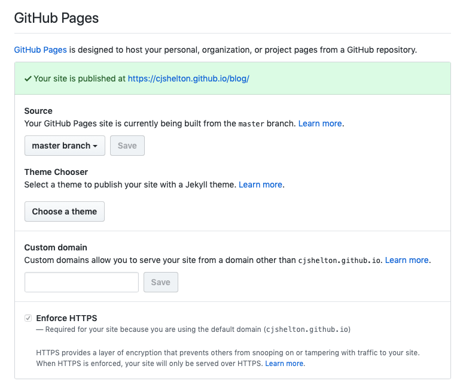

# Introduction

I have created a few simple static websites like this before, mainly when I was quite new to web development. I have spent most of my early software development career building ASP.NET MVC web applications, which one approaches in a totally different way -- you already have the framework there for layout pages, partials and programmatically displaying content through Razor syntax.

When it came to creating this blog, I knew I didn't need anything fancy; I needed something simple, cheap to run and easy to maintain. It always bugged me how, with static websites I had previously built, all of the boilerplate content was duplicated between HTML files -- the head (including meta tags, favicons and CSS), the navbar, the footer and general page layout. As the website grows, it becomes hard to maintain and more prone to simple development mistakes. Any new pages require a copy and paste of content, and any edits to this content must be applied individually to all pages.

Considering the [DRY principle][dry-principle-url], this involved a lot of RY and not a lot of DRY. I wanted to find a better way to do it, and that's how I came across the combination of Jekyll and GitHub Pages which offered the workflow improvements I was after.

<div class="logo-duo-container">
    
    
</div>

[Jekyll][jekyll-url] is an open source static site generation tool written in Ruby. Static site generators like Jekyll simplify the process of building and maintaining static websites. Jekyll is also blog-aware, meaning it has features which make the process of creating a blog much easier, since a blog can be represented as a series of files served statically over the web.

Some of the most useful features of Jekyll I have found include:

-   Support for Markdown and automatic conversion to HTML.
-   Support for SASS and minification out-of-the-box.
-   Front Matter to set page variables and metadata.
-   Support for Liquid templating to programmatically set page content.
-   Layouts and Includes to avoid page duplication and promote a modular page structure.
-   It is CLI-driven making it easy to create custom scripts and automate your workflow.

The Jekyll website explains all of the above well, and has an easy-to-follow tutorial to get you started writing a simple blog.

[GitHub Pages][github-pages-url] is a free hosting platform provided by GitHub for websites that use static content, and is a natural choice for blogs written in Jekyll. It allows you to turn a public GitHub repository into a live static website, supporting Jekyll out-of-the-box so your site will be built and published on push to your selected branch.

# Setup

I vary which machine I develop on, but for small development projects like this which aren't tied to Windows, I tend to use my Mac. Jekyll runs on Ruby which was already installed on my Mac, along with the RubyGems package manager (I believe they're pre-installed on all Mac machines by default). After updating my Ruby and RubyGems versions, I only had to run the below commands to install Jekyll and the Bundler, and scaffold a new blank Jekyll project.

```
sudo gem install jekyll bundler
jekyll new --blank \Blog
```

Installation is fairly trivial, and there are good instructions on the Jekyll website for installation on different environments. [This article][github-pages-jekyll-config-url] is also useful as it describes how to configure your Gemfile specifically for hosting on GitHub Pages.

# Enabling GitHub Pages

Turning your repo into a live website is pretty straight forward, and can be done from the repo settings.



I chose the master branch as the one that should be listened to for any changes. Representing my live code base, whenever any new commits are made to this branch, the code is automatically built and the Jekyll output published. I opted not to go for a theme as I wanted to write all of the styling myself, and have not hooked up the site to a custom domain as I am happy to take the free hosting and HTTPS from GitHub!

_N.B. After initially enabling GitHub pages, it can take around 30 mins for the change to take effect, but subsequent changes are made live straight away._

# Creating the "Walking Skeleton"

As I do with most projects (in and out of work), I always try to start off with the most basic product and use that to setup my local development environment and prove the whole build and release process. Having both of these in place early makes development a smoother and more efficient experience. Solving issues with your environment or release process is much easier when there are fewer variables involved -- a small code base lessens the chance that any early issues are being caused by your code.

## Setting up my Local Dev Environment

The first step involved creating the Git repo and pointing it at my newly scaffolded Jekyll project. I followed the Jekyll tutorial to get the basic configuration in place and have my basic site running on a local server using the Jekyll `serve`{:.code-inline} command. This command optionally takes in a few arguments to configure the application on start-up, and because I am using the bundler, I needed to prefix the command with `bundle exec`{:.code-inline}. I quickly realised that having a script to start my site locally would be useful. I created a shell script which first cleans the output `_site`{:.code-inline} directory, thens fire up Chrome on the expected port before finally spinning up the site locally with my specific configuration. The script is available in my repo as `sh-serve.command`{:.code-inline}.

## Proving the Build &amp; Release Process

As a Walking Skeleton, I chose to deploy a simple `index.html`{:.code-inline} page with a basic nav and footer. I merged these changes into my master branch to kick off a Jekyll build of my site in GitHub Pages. This highlighted an issue with my Gemfile. After fixing that, my changes were live.

# Styling and Structure

Once I had proved my build and release process, I got on with designing the general theme and structure of the blog, making use of the Jekyll features listed above to reduce the need for duplication and to make it as easy as possible to make future edits. The main ways I achieved this was to use Layouts, Includes and Data Files.

## Layouts

One of the main benefits I have found from using a static site generator is being able to define layout pages and use them to structure pages in a more readable and maintainable way.

I created a Main layout page to act as the base HTML for all pages, containing placeholders for the header, nav, body and footer content, included using Liquid syntax. This means that all pages are based on the same HTML, ensuring consistency in the event of any changes.

```
<!doctype html>
<html>
    <head>
        
    </head>
    <body>
        <header>
            
        </header>
        <div id="site-content">
            {{ content }}
        </div>
        <footer>
            
        </footer>

        <script src="{{ "/assets/js/lib/jquery-3.3.1.min.js" | relative_url }}"></script>
        <script src="{{ "/assets/js/lib/bootstrap.min.js" | relative_url }}"></script>
    </body>
</html>
```

Every blog post has a very similar structure, so it makes sense to make use of a Layout page here too for defining the Bootstrap grid layout and setting the blog title, date published and blog content through Liquid syntax. Layout pages can use other layout pages. Using Front Matter defined at the top of the page, I configured the Post layout to make use of the Main layout:

```
---
layout: main
---
<div class="container">
    <div class="row">
        <div class="col-md-12">
            <h2 id="post-title">{{ page.title }}</h2>
            <h4 id="post-published-date">Published: {{ page.date | date_to_string }}</h4>

    <!-- Code removed for brevity -->
```

## Includes

Similar to Layouts, Includes help reduce duplication and promote a cleaner, more modular approach to defining HTML. For those who are familiar with ASP.NET, Includes work like Partial Views, abstracting the HTML out to separate files, allowing pages to be built from components which can be shared amongst other pages.

I created Includes for HTML that either needed to be used in multiple places, or when it was defining a logical component of the website. It made sense to create Includes for the following components:

-   Head
-   Footer
-   Navigation

Although not shared between pages, these components helped simplify the HTML of the main layout page, and set a precedent for abstracting out code to prevent any wildly long HTML source files.

## Data Files

Data Files are a way to define site and page content in configuration files, outside of your HTML, and have it included in your page using Liquid. Data Files are another good way to avoid repetition in your HTML and allow you to separate out your site configuration, rather than bloating the `_config.yml`{:.code-inline} file.

For example, following the Jekyll tutorial, I created a Data File called `navigation.yml`{:.code-inline} in the `_data`{:.code-inline} directory to drive the content of the nav bar with the following contents:

```
links:
  - name: Home
    link: /
  - name: Search
    link: /search.html
  - name: All Posts
    link: /all.html
```

As can be seen below, this data can be accessed from within the nav HTML, iterated over using a Liquid for-loop, to generate the different nav elements. Any additional nav elements require only a change to this configuration file -- another example of adopting the DRY principle.

```
<nav class="navbar navbar-expand-sm">
    <!-- Code removed for brevity -->
    <div class="collapse navbar-collapse ml-auto" id="blog-nav">
        <div class="navbar-nav ml-auto">
            
                <div class="outer-nav-link">
                    
                        <span class="current-link-brace">{</span>
                        <a class="{{ site.data.navigation.link-classes }} current" href="{{ item.link | relative_url }}">
                            <span>{{ item.name }}</span>
                        </a>
                        <span class="current-link-brace">}</span>
                    
                        <span class="not-current-link-brace">{</span>
                        <a class="{{ site.data.navigation.link-classes }} not-current" href="{{ item.link | relative_url }}">
                            <span>{{ item.name }}</span>
                        </a>
                    
                </div>
            
        </div>
    </div>
</nav>
```

# Writing Blog Entries

Jekyll is blog-aware, meaning it has built-in features to make building blog websites simpler. One of the key features is being able to write blog posts in Markdown and have them automatically converted to HTML as part of the build process. To achieve this, Jekyll uses a Markdown parser plug-in which by default, offers good results, but can easily be configured to tailor the HTML output further.

Being able to write blog posts in this way has some significant benefits:

1. Simplicity - You can forget about `<div>`{:.code-inline} and `<p>`{:.code-inline} tags. Markdown has very simple syntax, meaning you can focus more on the actual content of the blog posts. There's also no need for a database to fetch your post content from -- everything is driven from static files.
1. Portability - Markdown has been widely adopted as a markup language, and is a good way of adding content to wiki pages. It's very readable in its raw format which makes distribution a lot easier, even to those who have never heard of it.
1. Source control everything - Markdown files can easily be source controlled. This means everything that is required to generate this website is tracked in my repo.

# Maintaining the Blog

As with all websites that are built from scratch, there was an initial ramp-up of effort to get the blog in a place I was happy with -- setting up the repo, configuring Jekyll and my local development environment, structuring and styling the site, and getting a simple and repeatable deployment process in place.
But now all that is done, assuming I don't want to make any radical changes to the look and feel of the blog, keeping it up-to-date with fresh posts is easy.

Writing a new blog entry is now just as simple as writing the Markdown and committing the new file to the repo, with a bit of SASS in there if I'm wanting something styled a particular way. This is in stark contrast to the way I currently maintain some other static websites which require changes across multiple files, a lot of which is copying and pasting.

The source code for this blog is available publicly so feel free to have a look around and reach out if you have any questions.

[dry-principle-url]: https://en.wikipedia.org/wiki/Don%27t_repeat_yourself
[jekyll-url]: https://jekyllrb.com
[github-pages-url]: https://pages.github.com
[github-pages-jekyll-config-url]: https://help.github.com/articles/setting-up-your-github-pages-site-locally-with-jekyll/
