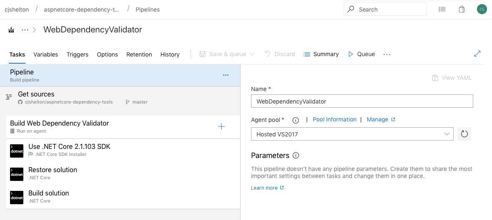
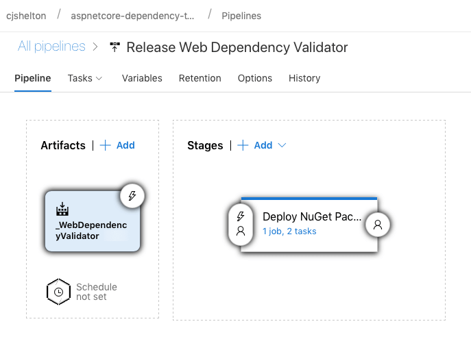
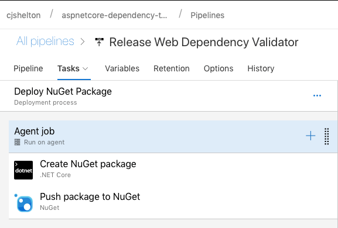
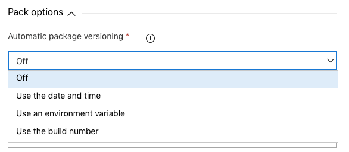

# Introduction

I am keen to start contributing more to Open Source Software. Contribution can come in many forms: improving docs, creating libraries, fixing bugs or even adding features to existing libraries and frameworks. I recently had an idea for creating a NuGet package to assist with identifying ASP.NET Core application dependencies which had not been registered in IoC, and therefore causing a runtime error.

This post outlines the process of creating a .NET Standard Library which is packaged and pushed to NuGet using Microsoft Azure.

# The Idea

Compared to the traditional .NET Framework, .NET Core approaches web application development in a different way, adopting a pipeline approach to handing HTTP requests, built-in logging and dependency injection, and more. An IoC container is built-in to promote a dependency injection focused way of structuring classes.

From time to time I would find myself creating a new service and adding it as a constructor dependency, but forgetting to register the new service in the IoC container. For those familiar with ASP.NET Core development, this doesn't cause a build error and the app starts up without issue, and unit testing does not help because constructor dependencies are mocked and passed in as part of the test. The problem is only obvious once you try to access a controller which uses the unregistered dependency (either directly or indirectly via another dependency) which results in a runtime error. If the developer exception page option has not been enabled during development, it won't be immediately obvious what the problem is.

It seems wrong for the app to start-up and accept requests when the it is not configured correctly and will produce a server error when certain routes are accessed. I had an idea to create a NuGet package to verify that all dependencies had been setup in IoC, and to stop app execution if any had not been registered.

# Creating the Library

Although the package is exclusive to ASP.NET Core applications, I chose to create the library as a .NET Standard Class Library. .NET Standard is now the obvious choice for any shared libraries to ensure cross compatibility across the .NET ecosystem.

## How It Works

The concept is quite simple:

**On app start, once all dependencies have been loaded into the container as instructed in `Startup.cs`, discover all available ASP.NET controllers, and for each constructor dependency of each controller, check that the dependency can be resolved from IoC.**

Dependencies will fail to be resolved if they either have not been registered themselves, or if any of their own dependencies cannot be resolved. This technique performs a traversal of the dependency tree from the controller level and identifies if any app dependencies have not been registered. If any unregistered dependencies are found, a critical log is attempted using Microsoft's built-in `ILogger` and an exception is raised describing what has happened. Assuming no generic exception handling exists at this point, the exception will bubble up and stop the app from executing.

## The Implementation

The validator has been created as an extension method on the `IServiceCollection` interface. I am generally not a fan of extension methods and like to always question my use of them. This is for a few reasons:

1. Extension methods are, and have to be, declared as static. Statics are hard to unit test and they also cause testing problems for classes that use them. Static methods cannot be (easily) mocked so their functionality cannot be predictably controlled as part of a test. Statics also cause unpredictable behaviour if they are not used correctly.
1. Extension methods are an easy way to hide complexity. They are easy to create and often overlook the important step of software architecture.

However, my choice to create an extension method here was guided mainly by Microsoft's approach to service management in the `Startup` class. Services are added to the container using extension methods and the current pattern for working with the `IServiceCollection` interface is through extension methods. I wanted the Web Dependency Validator to work in the same way and be consistent with how it should be used. This library is only useful on app start and does not need to be used anywhere else in the application code. An example of using the WebDependencyValidator can be seen below.

```
public void ConfigureServices(IServiceCollection services)
{
    // You need to get the instance of IMvcBuilder after adding the MVC services to the IoC container.
    IMvcBuilder mvcBuilder = services.AddMvc().SetCompatibilityVersion(CompatibilityVersion.Version_2_2);

    // Add services to the IoC container.

    // Finally, validate that all dependencies can be satisfied from the IoC container.
    services.ValidateControllerDependencies(mvcBuilder);
}
```

The alternative approach here would be to have a `WebDependencyValidator` class which implements say `IWebDependencyValidator` which contains a method named `ValidateControllerDependencies`. This interface would have to be registered in IoC and then called shortly after.

I'm happy with my choice of implementation for now, but that might change in the future.

For a better understanding of how it has been implemented, the source code is available on my GitHub page. There is also more information and usage instructions in the `README`.

### Building and Publishing to NuGet with Azure

I wanted to automate as much of the build and deployment as possible. I chose Azure DevOps as the CI/CD tool because open source GitHub projects are provided with unlimited CI/CD minutes and 10 parallel jobs for free. I also wanted to widen my reach of working with different cloud CI/CD providers.

Builds in Azure DevOps are capable of doing deployments as well as building your code. However, it made sense to split the release stage from the build stage. This allows me to make a change without needing to deploy it to NuGet. For example, if I make a change to the project README, I do not want to push out a newer version of the package.

The build steps should look familiar to anyone who has set up a CI build of a .NET project before.



1. Declare the pipeline to run on an agent in the Hosted VS2017 Agent Pool. Other Agent Pools are available and can be used with .NET Core builds, but since I have a solution file, the Hosted VS2017 Agent Pool is required.
1. Fetch the source code from the master branch in GitHub. The CI build trigger is for any new commits to master.
1. Explicitly set the version of the dotnet SDK to be used. This ensures consistency between builds.
1. Restore the dependencies of the solution.
1. Build the solution.

The output of the build is then fed into the Release pipeline below.



1. The artifacts for the release are the outputs of the build stage.
1. No automatic trigger or schedule has been configured; releases must be triggered manually. This is a conscious decision to allow changes to be made to the project without creating a new version of the package everytime.



The stages for release, as shown above, involve two key tasks:

1. Using the `dotnet pack` command, create a NuGet package for the library.
1. Push the newly created NuGet package to NuGet using an already configured NuGet Server connection.

### Package Versioning

The recommended way to version NuGet packages is to follow the Major.Minor.Patch semantic versioning pattern. This isn't trivial to automate and didn't feel high priority for this initial piece of work, so I opted for the basic approach of setting the latest version explicitly in the `csproj` file.

There are a few options which can be used for automatic versioning when using the `dotnet pack` command.



Eventually it would be good to move to a more automated approach, relying less on the version number being incremented manually for each release. I would probably achieve this through the use of environment variables for Major and Minor, and use the build number for Patch. I may also look into [Git Version][git-version-url] which infers a semantic version based on the git workflow in place.

[git-version-url]: https://gitversion.readthedocs.io/en/latest/
