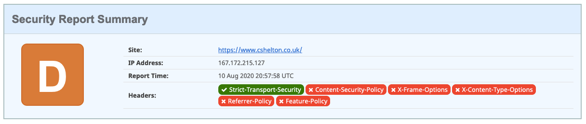
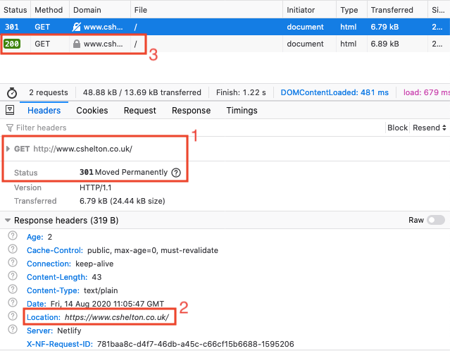
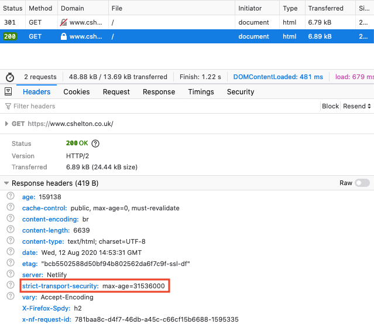
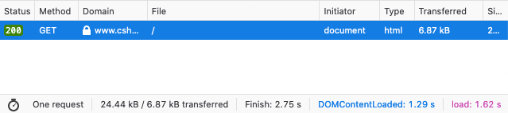

# Introduction

Netlify is a great platform for simple web hosting, which comes with a whole load of benefits including a generous free plan, HTTPS out-of-the-box, and cool features like AWS Lambda integration and form submissions. I plan on writing a blog post specifically about Netlify, including how I use it and what benefits I get from it.

I was made aware, that by default, some HTTP Security Headers are not set by default on Netlify, and sure enough, for my Portfolio site, most were not set which resulted in a pretty poor rating on [Security Headers][security-headers-url]:

As you can see above, the poor rating is due to Content Security Policy, X-Frame Options and other security headers not being setup or configured correctly.

I was keen to fix these security issues, and blog my process.

# Security Headers - what and why?

Security headers are instructions sent by the browser in the HTTP response which inform the browser how to handle communication with it, specifically in a way which maximises the security of the communication.

There are numerous security headers which can be sent by the server, but the most common, and ones which I'll be focusing on are:

-   HTTP Strict-Transport-Security (HSTS)
-   Content-Security-Policy
-   X-Frame-Options
-   X-Content-Type-Options
-   Referrer Policy
-   Feature-Policy

## HTTP Strict-Transport-Security (HSTS)

The HSTS header sent by the server informs the browser that any requests made to a site must only be made using HTTPS. HSTS is not to be confused with HTTPS redirection, which is a configuration setting on the server which will force redirect any traffic made over HTTP to use HTTPS.

The instruction to always use HSTS is remembered by the browser after the initial request, so that the browser knows that any subsequent requests made to the server should never be made using HTTP, only HTTPS. The browser will automatically convert a request made over HTTP to use HTTPS. This instruction is not tied to the user's browser session, and persists for as long as indicated in the header using the `max-age` directive (typically one year).

The server will always respond with the HSTS header, even if the browser has already received this instruction previously. This means that every time the user visits the site, the expiry date of the HSTS instruction stored by the browser is continually updated, ensuring that the user is protected for as long as possible with a reduced chance of the instruction ever expiring.

### An Example Flow

1. The user accesses `http://www.cshelton.co.uk/` for the very first time (note the use of HTTP, not HTTPS)
1. The browser has never received the HSTS header for this site before, so continues to send the request over HTTP.
1. HTTPS redirection is setup on the server, which issues a `301 Moved Permanently` HTTP response to the browser, with an updated location URL, so the browser can issue the request again, but using HTTPS.
   
1. The server responds to the now secure request with the page content, along with the HSTS header in the HTTP response.
   
1. The browser stores the HSTS instruction to be used for subsequent requests.
1. The user accesses the site again, or another page on the site, over HTTP.
1. Before sending the request to the server over HTTP, the browser realises that it has an instruction to only send requests using HTTPS, so it automatically converts the request to use HTTPS and then submits it to the server, resulting in only one secure request being made.
   

### Resolution

Fortunately, all Netlify apps are served over HTTPS and use HTTPS redirection by default, for no cost -- this is an excellent move by Netlify &#128077;.

As can be seen above, HSTS is already in action on my site, configured automatically by Netlify, so I didn't have to do any work here. Result!

[security-headers-url]: https://securityheaders.com/
