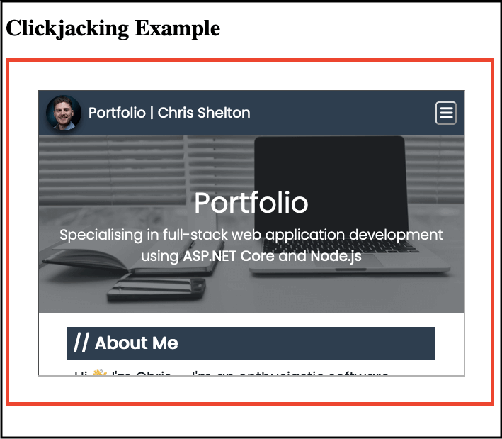

# Introduction

Netlify is a great platform for simple web hosting, which comes with a whole load of benefits including a generous free plan, HTTPS out-of-the-box, and cool features like AWS Lambda integration and form submissions. I plan on writing a blog post specifically about Netlify, including how I use it and what benefits I get from it.

I was made aware, that by default, some HTTP Security Headers are not set by default when hosting a site on Netlify, and sure enough, for my Portfolio site, most were not set which resulted in a pretty poor rating on [Security Headers][security-headers-url]:


As you can see above, the poor rating is due to Content Security Policy, X-Frame Options and other security headers not being setup or configured correctly.

I was keen to fix these security issues, and blog my process.

# Security Headers - what and why?

Security headers are instructions sent by the server in the HTTP response which inform the browser how to handle communication with it, specifically in a way which maximises the security of the communication.


It's hard to talk about web security and not mention [OWASP][owasp-url] -- the Open Web Application Security Project. If you're not familiar with OWASP, and you are involved in the technical aspects of web application development, regardless of technology, it is recommended you familiarise yourself with the guidelines to help you and your team build more resilient and secure applications.

Importantly, OWASP has a project specifically for providing guidance on securing web applications through the use of HTTP headers -- the [OWASP Secure Headers Project][owasp-secure-headers-project-url] -- which defines them as:

> ...HTTP response headers that your application can use to increase the security of your application. Once set, these HTTP response headers can restrict modern browsers from running into easily preventable vulnerabilities. The OWASP Secure Headers Project intends to raise awareness and use of these headers.

There are numerous security headers which can be sent by the server, but the most common, and ones which I'll be focusing on are:

-   HTTP Strict-Transport-Security (HSTS)
-   Content-Security-Policy
-   X-Frame-Options
-   X-Content-Type-Options
-   Referrer Policy
-   Feature-Policy

## Setting Security Headers in Netlify

There are a couple of ways to set headers in Netlify -- using a `netlify.toml` configuration file or using a `_headers` file. I chose the latter, initially for simplicity. The [documentation][netlify-headers-file] explains how to use this file.

# HTTP Strict-Transport-Security (HSTS)

The HSTS header sent by the server informs the browser that any requests made to a site must only be made using HTTPS. HSTS is not to be confused with HTTPS redirection, which is a configuration setting on the server which will force redirect any traffic made over HTTP to use HTTPS.

The instruction to always use HSTS is remembered by the browser after the initial request, so that the browser knows that any subsequent requests made to the server should never be made using HTTP, only HTTPS. The browser will automatically convert a request made over HTTP to use HTTPS. This instruction is not tied to the user's browser session, and persists for as long as indicated in the header using the `max-age` directive (typically one year).

The server will always respond with the HSTS header, even if the browser has already received this instruction previously. This means that every time the user visits the site, the expiry date of the HSTS instruction stored by the browser is continually updated, ensuring that the user is protected for as long as possible with a reduced chance of the instruction ever expiring.

## An Example Flow

1. The user accesses `http://www.cshelton.co.uk/` for the very first time (note the use of HTTP, not HTTPS)
1. The browser has never received the HSTS header for this site before, so continues to send the request over HTTP.
1. HTTPS redirection is setup on the server, which issues a `301 Moved Permanently` HTTP response to the browser, with an updated location URL, so the browser can issue the request again, but using HTTPS.
   
1. The server responds to the now secure request with the page content, along with the HSTS header in the HTTP response.
   
1. The browser stores the HSTS instruction to be used for subsequent requests.
1. The user accesses the site again, or another page on the site, over HTTP.
1. Before sending the request to the server over HTTP, the browser realises that it has an instruction to only send requests using HTTPS, so it automatically converts the request to use HTTPS and then submits it to the server, resulting in only one secure request being made.
   

## Resolution

Fortunately, all Netlify apps are served over HTTPS and use HTTPS redirection by default, for no cost -- this is an excellent move by Netlify <span role="img" aria-label="Thumbs up emoji">&#128077;</span>.

As can be seen above, HSTS is already in action on my site, configured automatically by Netlify, so I didn't have to do any work here. Result!

# Content-Security-Policy (CSP)

Now onto the first security header which has been flagged as missing -- Content Security Policy.

The CSP header is an important one to help guard against Cross-Site Scripting (XSS) attacks. XSS is [recognised by OWASP][owasp-top-ten] as being one of the top 10 most critical security risks to web applications, so it's key to be aware of this attack and how to guard against it.

One way to help guard against XSS is to make use of the CSP header, and make sure it's configured to be as strict as possible. A CSP is a way for a web server to tell the browser what kind of content is allowed for a site, and if that content is hosted externally, where is it allowed to come from. A CSP is defined by a set of semi-colon delimitered policy directives, where a policy directive takes the form `<directive name> <directive value>`.

There are many directives which help restrict content, but some of the most common are:

-   `default-src` - Acts as a fall back source for any directives which haven't been specified.
-   `script-src` - Restricts how JavaScript can be used on the site.
-   `style-src` - Restricts how CSS can be used on the site.
-   `img-src` - Restricts how images can be used on the site.

For each directive included, the value must be supplied, which defines how that content can be included and used. Typically, most content will come from your own domain, like external JS files, style sheets and images, and for that, you can specify your own domain. You may then provide additional domains for whitelisting specific content, like Google Analytics scripts for example, or styles from a Content Delivery Network (CDN). It's important to note that this also applies to inline `<script>` and `<style>` tags -- unless explicitly whitelisted using the `unsafe-inline` value, inline content will be blocked by default.

It's not difficult to see from the directives above how a strict CSP can help guard against XSS attacks -- by specifying exactly where content should come from, specifically script content, and how it should be executed, an attempt to load in a script tag entered maliciously by an attacker can be prevented by the browser.

Consider carefully whether to use the `unsafe-inline` value, as this begins to negate the benefit having the CSP against XSS attacks. You may find you can extract your inline scripts and styles to external files instead, unless you are making use of patterns like critical CSS, where that's not possible, and you will have to look into safer approaches, like hashing or using a nonce value. Troy Hunt wrote a [good article][troy-hunt-hash-nonce] about the safer alternatives to using `unsafe-inline` -- it's definitely worth a read.

Ultimately, unless you have a very basic application, configuring the CSP header, and doing it properly, is not a trivial task. This was my first time implementing one, and it does feel like there's a certain art to it. There are many ways to set the values of the policy directives, including using wildcards and specifying the allowed scheme and port. I would recommend reading up further on CSP before implementing your own.

## Resolution

Something very useful to know when configuring your CSP, is the `Content-Security-Policy-Report-Only` header, which acts just like the `Content-Security-Policy` header, only it reports back what issues you'd be having with your CSP, rather than actually applying it. This makes testing much easier and safer against a live site, if that's all you have (as I do).

I first added just the `default-src` directive with my own domain as the value, pushed my changes, and then checked the browser console:


Lots of errors... good? It shows my new header is working, but is only reporting the errors to me, so I can see what changes I need to make.

Anyway, after a lot of experimentation, my final CSP header looks like this:

```
/*
    Content-Security-Policy: default-src https://*.cshelton.co.uk; script-src https://*.cshelton.co.uk https://www.googletagmanager.com https://www.google-analytics.com 'unsafe-inline'; style-src 'unsafe-inline'; img-src data: https://*.cshelton.co.uk www.google-analytics.com
```

A few things to note:

-   I have set my `default-src` directive to `https://*.cshelton.co.uk`, so that the fallback for any omitted directive is to only allow the content to come from my domain, over HTTPS.
-   As well as whitelisting my own domain in the `script-src` directive, I am permitting script content to be loaded specifically for Google Analytics to work. I am also, unfortunately, permitting scripts to be loaded inline, which is a side effect of using Gatsby, which introduces inline script tags in my pages.
-   I am also permitting style content to be loaded inline, another side effect of using CSS-in-JS and Gatsby, which inserts my page styles into the `<head>` of each page, for quicker page load times.
-   As well as whitelisting my own domain in the `img-src` directive, I am also permitting images to be loaded using the `data` scheme, which is used to embed images using a base-64 string, and from Google Analytics, which is required.

As noted above, my CSP is certainly not as strong as I'd like, but I am somewhat limited to the way Gatsby works, and ultimately, my site is purely static, with no user content other than my own, so I'm not too concerned. The [gatsby-plugin-csp][gatsby-plugin-csp] seemed like an option to use hash values instead of `unsafe-inline`, but there is a known [compatibility issue][gatsby-plugin-csp-compatibility-issue] which prevents me from using it. I will be keeping an eye on any improvements to Gatsby and its plugins which might allow me to tighten up my policies in the future.

For now anyway, I do get some limited protection with this CSP header in place, and checking my site against [Security Headers][security-headers-url] again, I can see I have a <span role="img" aria-label="Tick emoji">&#9989;</span> for CSP, and a slightly improved rating -- getting there!


# X-Frame-Options (XFO)

The `<iframe>` HTML element allows a site to embed another site's content within it, much like in the screenshot below, where I created a basic test page with an `<iframe>` pointing to my Portfolio site:



It has its uses, but the `<iframe>` tag can be used to facilitate a malicious [Clickjacking][owasp-clickjacking] attack, where an invisible `<iframe>` is placed in front of a malicious site, which tricks the user into clicking on a button within it, which has most likely rendered a genuine site which the user is already logged into, causing the user to perform an authenticated action unknowingly.

I highly recommend reading [Troy Hunt's blog post on Clickjacking][troy-hunt-clickjacking-blog-post], where he walks through an example and talks in more detail about the implications of the attack.

So now onto the XFO header, which is a fairly simple one (compared to CSP at least) -- this header instructs the browser what to do when a site is being rendered into an `<iframe>`.

There are two supported directives:

-   `DENY` - Do not allow the site to be loaded into an `<iframe>`.
-   `SAMEORIGIN` - Only allow the site to be loaded into an `<iframe>` from within a page on that same site.

## Resolution

I have no requirement for any site, not even my own, to be able to render my site within an `<iframe>`, so I chose the `DENY` directive here.

```
/*
    Content-Security-Policy: default-src https://*.cshelton.co.uk; script-src https://*.cshelton.co.uk https://www.googletagmanager.com https://www.google-analytics.com 'unsafe-inline'; style-src 'unsafe-inline'; img-src data: https://*.cshelton.co.uk www.google-analytics.com
    X-Frame-Options: DENY
```

After doing so, the `<iframe>` on my basic test site no longer works, and I can see a suitable error in the browser console.


And the XFO response header is visible in the network tab when trying to request the page:


Running my site through [Security Headers][security-headers-url] yet again, the rating has improved and I now have a <span role="img" aria-label="Tick emoji">&#9989;</span> against `X-Frame-Options`:


# X-Content-Type-Options

Next up is the `X-Content-Type-Options` header, which is one of the simplest to configure, and only has one possible directive -- `nosniff`. This header instructs the browser not to do any [MIME type sniffing][mime-type-sniffing], and instead, rely on the MIME type provided in the `Content-Type` header from the sever without changing it.

This helps prevent the browser from downloading a potentially malicious file without the user's consent, AKA a "Drive-by download". It also helps ensure that files being downloaded with consent, remain the type specified, without, for example, the browser changing them to an executable.

I added this header to my `_headers` file:

```
/*
    Content-Security-Policy: default-src https://*.cshelton.co.uk; script-src https://*.cshelton.co.uk https://www.googletagmanager.com https://www.google-analytics.com 'unsafe-inline'; style-src 'unsafe-inline'; img-src data: https://*.cshelton.co.uk www.google-analytics.com
    X-Frame-Options: DENY
    X-Content-Type-Options: nosniff
```

And observed that it is now being sent in the response headers:


[Security Headers][security-headers-url] now shows an A rating along with a <span role="img" aria-label="Tick emoji">&#9989;</span> against `X-Content-Type-Options`:


[security-headers-url]: https://securityheaders.com/
[owasp-url]: https://owasp.org/
[owasp-secure-headers-project-url]: https://owasp.org/www-project-secure-headers/
[owasp-top-ten]: https://owasp.org/www-project-top-ten/
[troy-hunt-hash-nonce]: https://www.troyhunt.com/locking-down-your-website-scripts-with-csp-hashes-nonces-and-report-uri/
[netlify-headers-file]: https://docs.netlify.com/routing/headers/
[gatsby-plugin-csp]: https://www.gatsbyjs.com/plugins/gatsby-plugin-csp/
[gatsby-plugin-csp-compatibility-issue]: https://github.com/gatsbyjs/gatsby/issues/10890
[owasp-clickjacking]: https://owasp.org/www-community/attacks/Clickjacking
[troy-hunt-clickjacking-blog-post]: https://www.troyhunt.com/clickjack-attack-hidden-threat-right-in/
[mime-type-sniffing]: https://developer.mozilla.org/en-US/docs/Web/HTTP/Basics_of_HTTP/MIME_types#MIME_sniffing
