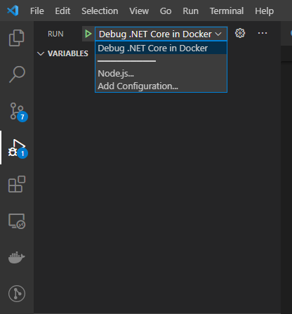
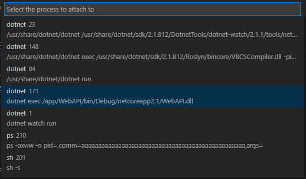

# Introduction

I have typically always used [Visual Studio][vs-url] for .NET development, mainly out of habit, and it pretty much being
a necessity for building apps with the .NET Framework. But also because it is a very powerful IDE for development, debugging and
running tests, with minimal configuration required.

In contrast, I do all of my JavaScript development using [Visual Studio Code][vscode-url], which is likely no surprise to
most people. My apps are typically all setup to run inside Docker with live reload enabled, meaning any of my changes are
reflected almost instantly, without the need for re-building any containers. **This is a really efficient way of developing.**

I was keen to try and adopt a similarly efficient setup for my .NET development. I had tried VS Code for .NET Core in the
past, but it never quite worked how I wanted, and I always felt a little less productive then I would be using Visual Studio.

This post aims to explain how to setup an efficient local .NET Core development environment in Docker with debugging and
live compilation (see changes immediately without needing to re-build the Docker container) using VS Code.

# Setting Up the Docker Image

The first step is to add our initial Dockerfile for running the .NET Core WebAPI inside a Container. The Dockerfile, as shown below, is nice and simple, and as a result, is really only suitable for building development Containers; a Dockerfile for a production application would look more complex than this, including separate steps to restore, build and publish the application, but that's beyond the scope of this blog post.

```
# 1
FROM mcr.microsoft.com/dotnet/core/sdk:2.1 AS build

# 2
WORKDIR /app
COPY . .

# 3
ENV ASPNETCORE_URLS=http://*:5000
ENV ASPNETCORE_ENVIRONMENT=Development

# 4
WORKDIR /app/WebAPI

# 5
ENTRYPOINT ["dotnet", "run"]
```

The main steps in the Dockerfile are:

1. Base the image on the .NET Core 2.1 SDK. The SDK base image has all the tools we need to compile and run the application.
1. Copy all of the project files into a new `/app` directory within the image.
1. Set a couple of environment variables needed for running the application in development mode.
1. Set the working directory to the root of the web application where the project files are.
1. Set the command to run when the Container is started. In this case, `dotnet run`, which performs a restore and build of the application before running it.

Whenever I'm using Docker, I always use Docker Compose for running Containers. Below is an example Docker Compose file for running the application:

```
version: "3"
services:
  webapi:
    container_name: webapi
    build:
      context: ./server/
      dockerfile: ./Dockerfile.dev
    ports:
      - 5000:5000
```

Again, this is nice and simple, specifying a name for the resulting container, the build context and Dockerfile to use, and finally the port bindings.

And now the app can be spun up by running the following command:

```
docker-compose up --build webapi
```

In under a minute, your app should be up and running in a Docker Container and ready to receive requests.

The next step is to add Live Compilation, so that any changes to the source code are automatically built and served up, without needing to stop and re-build the image again.

# Adding Live Compilation

As mentioned previously, Live Compilation allows for changes in your source code to be reflected inside your running Docker Container almost straight away, and without needing to rebuild the image again and again. This makes developing a .NET Core app in Docker a much more efficient and pleasant experience.

Adding Live Compilation requires just 2 simple changes to the current setup.

Firstly, change the Docker Container startup command to include the `watch` parameter, like so: `ENTRYPOINT ["dotnet", "watch", "run"]`. This uses the file watcher tool built into the .NET CLI, which will watch for file changes in your project, and run the command it is instructed to - in this case `run`, the same command we were using before to build and run the app.

Secondly, given the application is running inside Docker, we need to mount the source files as a volume in the Container. This allows the Container to still be connected to the project files on the host machine, allowing the File Watcher to detect any changes made. Without the volume mounting, the File Watcher would never know of any changes, and so would not know when to execute the `run` command again, nor would it have the updated source files. To mount the source files as a volume, we need to add a volume mapping in the Docker Compose file from the `server` directory on the host machine which holds the WebAPI project, to the `app` directory inside the Container. The Docker Compose file should now look like this:

```
version: "3"
services:
  webapi:
    container_name: webapi
    build:
      context: ./server/
      dockerfile: ./Dockerfile.dev
    volumes:
      - ./server/:/app
    ports:
      - 5000:5000
```

With these changes in place, running the app again should result in a message in the logs saying that the File Watcher is enabled.

Try changing one of your source files &mdash; you should see the File Watcher detect which file has changed and will rebuild the app automatically with the latest change applied.

# Enabling Debugging in the Docker Container

The final step is to get debugging working within the Container such that we can set breakpoints and step through the code, as you would typically do when running in Visual Studio. This requires two changes to our setup.

The first change to make is to install the Microsoft debugger for .NET Core in the image which the remote debugger in VS Code can be attached to. Add the following `RUN` command right after the initial `FROM` command in the Dockerfile:

```
FROM mcr.microsoft.com/dotnet/core/sdk:2.1 AS build

RUN apt-get update \
    && apt-get install unzip \
    && curl -sSL https://aka.ms/getvsdbgsh | /bin/sh /dev/stdin -v latest -l /vsdbg

# Remainder removed for brevity.
```

This command looks like it's doing quite a lot, but it's essentially updating the local package list, installing the `unzip` package and then finally downloading a shell script which is used to install the debugger by piping it to the shell executable, storing the output in `/vsdbg`.

The second step is to create a VS Code launch profile which can be used to attach the remote debugger to the debugger we just installed in the running Container. Add the following profile to the `configurations` array inside `./.vscode/launch.json`.

```
{
    "name": "Debug .NET Core in Docker",
    "type": "coreclr",
    "request": "attach",
    "processId": "${command:pickRemoteProcess}",
    "sourceFileMap": {
        "/app": "${workspaceRoot}/"
    },
    "pipeTransport": {
        "pipeCwd": "${workspaceRoot}",
        "pipeProgram": "docker",
        "pipeArgs": ["exec", "-i", "webapi"],
        "quoteArgs": false,
        "debuggerPath": "/vsdbg/vsdbg"
    }
}
```

Unless you're really interested, it's not important to get bogged down with the details of what is being configured here, but the key thing to note is the value being supplied to `debuggerPath` &mdash; the path to the `vsdbg` debugger we installed earlier. Change `"/app": "${workspaceRoot}/"` and `"pipeArgs": ["exec", "-i", "webapi"]` as appropriate based on your own project setup.

If you are interested to learn more about VSCode Launch Profiles, the official [docs][vscode-launch-json] has a detailed breakdown of each option and how they can be configured.

That's all we need to enable debugging inside the Docker Container.

To test it, first start the app as before using Docker Compose:

```
docker-compose up --build webapi
```

Once that has started successfully, head over to the Run tab in VSCode and choose the new launch profile we have just created and click the "Start Debugging" green button.



You will now be presented with the option to choose which process to attach the remote debugger to. Choose the process which is executing your DLL file, which in my case is `WebAPI.dll`.



After a few moments, the remote debugger should be attached, allowing you to hit any breakpoints you have set.


[vscode-url]: https://code.visualstudio.com/
[vs-url]: https://visualstudio.microsoft.com/vs/
[vscode-launch-json]: https://code.visualstudio.com/docs/cpp/launch-json-reference
