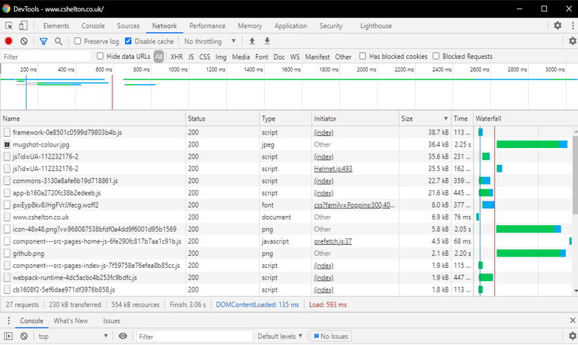
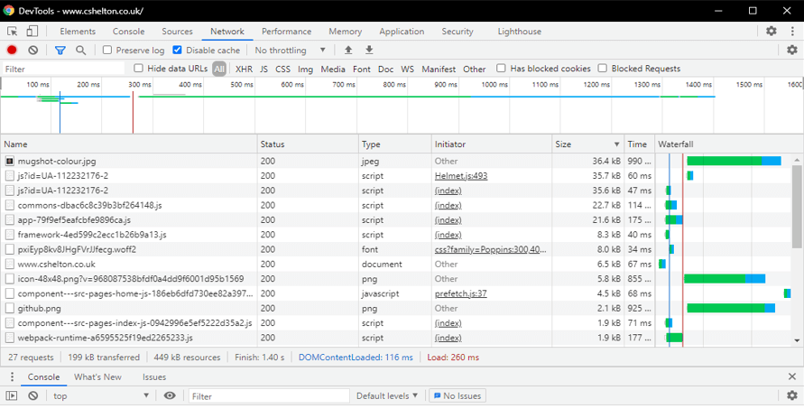
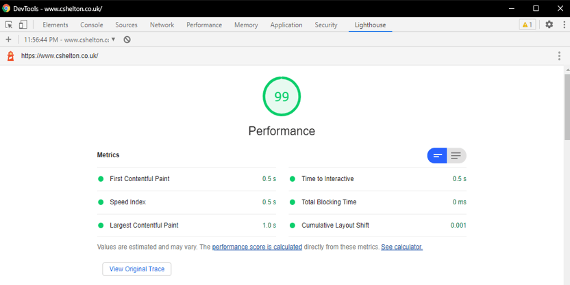
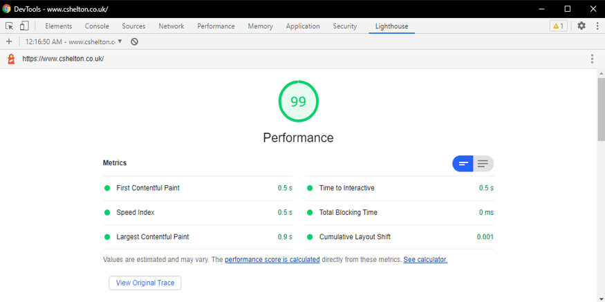
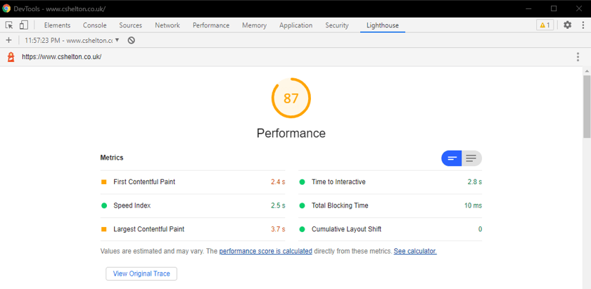
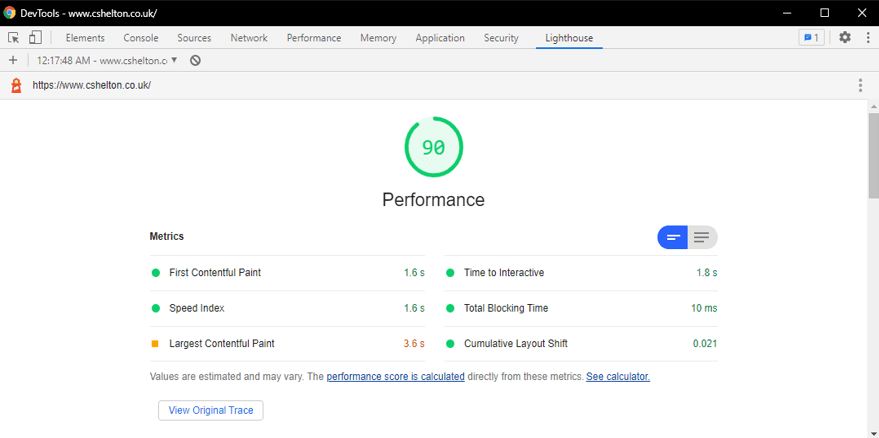

# Introduction

I recently learned of a Gatsby plugin which allows [React][react-url] to be replaced with [Preact][preact-url]. This simple
change helps improve the performance of Gatsby sites by reducing the size of the JavaScript payload which typically serves the
React code, ultimately resulting in a better user experience and improved Google Lighthouse scores, as shown
[later in this post](#my-results).

## The Importance of React in a Gatsby Site

React plays a fundamental role in a Gatsby site, right from the development process, to how it runs in the browser.

Firstly, pages in a Gatsby site are developed as React components, utilising all of the modern tooling developers have come to
expect when building modern web applications, including a modular project structure, modern ES syntax with [Babel][babel-url]
transpilation, unit testing, webpack and much more. All of this contributes to a much more developer friendly experience,
especially when creating static sites.

Secondly, React is used as part of the &quot;hydration&quot; process Gatsby sites go through, which allow a static site to be converted into a functioning React application in the browser.

### React Hydration

Gatsby sites are static sites, in that the output of the Gatsby build process is a series of HTML files and static assets which
can be hosted simply on a CDN as a typical static site would be; no special server functionality needed.

There is one key difference though &mdash; Gatsby uses [Server Side Rendering][gatsby-ssr-url], a feature of React, to generate server-rendered
static HTML files from the source files, meaning all pages are built and ready to be served in the browser. This is in
contrast to the more traditional client-side rendering approach.

Client-side rendering relies on the browser needing to render the HTML from assets and bundle files, which are typically
quite large in size. This ultimately leads to a snappy experience once the app has loaded, but this comes at the cost of
needing to download lots of assets up front, often leading to an initial period for the user where all they see is blank page
until these assets have finished loading and been processed by the browser.

The &quot;hydration&quot; process mentioned earlier plays a key role in the performance of a Gatsby site. As per the
[Gatsby docs][gatsby-hydration]:

> &quot;Hydration is the process of using client-side JavaScript to add application state
> and interactivity to server-rendered HTML.&quot;.

This essentially describes a process of first serving up the static content needed for the page requested by the
user, and then allowing React to take over and create a full React application for the whole site. Once the site becomes
&quot;hydrated&quot;, it can then make full use of the performance and optimisations of a React application, including
super-quick navigation (as subsequent page requests become just DOM updates with no further server requests needed).

This model is described in the [Gatsby docs][gatsby-hydration] as a hybrid server and client-side rendering model, with the benefits of both worlds &mdash; the fast start-up times of Server Side Rendering, and the snappy site navigation as a result of the DOM updates performed on a client-rendered application.

### Additional Links

-   For more information on React Hydration, see the [Gatsby docs][gatsby-react-hydration].
-   This [Gatsby blog post][gatsby-ssr-hydration-blog-post] is also a good overview of the hydration process and how Server
    Side Rendering is used.

# Preact

So where does Preact come into it? Preact is a lightweight alternative library to React, which aims to offer the same API
but at a lower cost to application performance.

The Preact library itself is only 3KB in size, which is around 15x smaller than the React library minified and compressed.
As we're talking in terms of KB here, some might argue that the change is not worth it, but considerations have to be taken
into account for users on slower network connections; the more KBs saved, the better experience those users will have.
Plus, a lot of sites, particularly static sites like blogs and portfolios, do not need to use React; Preact makes a lot
more sense in this case in my opinion.

Preact is not a direct replacement for React, and although it aims to offer very similar functionality, there are some
differences in functionality. See the docs for more info on [Preact][preact-url] and some of the notable differences from React.

React can very easily be swapped out with Preact in a Gatsby site. See the next section on how to do this.

# Installing and Configuring the Plugin

There is an [official Gatsby plugin][gatsby-preact-plugin-url] available which can be installed to do all of the work.

As per the plugin docs, install the Preact library along with the plugin and a utility library for rendering JSX and Preact
components to HTML:

```
npm install gatsby-plugin-preact@4.7.0 preact preact-render-to-string
```

**Note: As I'm running Gatsby v2, I had to install version 4.7.0 of the plugin; versions higher are compatible only with
Gatsby v3 currently.**

Once installed, add `gatsby-plugin-preact` to the `plugins` array in your `gatsby-config.js`.

And that's it! Run your app and check everything works as expected; in my case, I had no compatibility issues.

# My Results {#my-results}

I changed my Portfolio site to use Preact as well as a few other Gatsby sites I work on. In all cases, I saw a reduction
of roughly 30KB in app bundle size and an improvement in Google Lighthouse scores. For the minimal effort required, this
was a very worthwhile change for me to make.

Below are some screenshots of the bundle size and Google Lighthouse scores before and after the change to my Portfolio site.

## Screenshots

### Network Tab

**Before:** The framework bundle size is 38.7KB.



**After:** The framework bundle size is reduced to 8.3KB.



### Google Lighthouse - Desktop

**Before:** The Google Lighthouse score before the change.



**After:** The Google Lighthouse score after the change showing a slight improvement to the "Largest Contentful Paint" metric.



### Google Lighthouse - Mobile

**Before:** The Google Lighthouse score before the change showing an overall Performance score of 87.



**After:** The Google Lighthouse score after the change showing an overall Performance score of 90 and an improvement to numerous metrics.



[react-url]: https://reactjs.org/
[preact-url]: https://preactjs.com/
[babel-url]: https://babeljs.io/
[gatsby-hydration]: https://www.gatsbyjs.com/docs/glossary/hydration/
[gatsby-react-hydration]: https://www.gatsbyjs.com/docs/conceptual/react-hydration/
[gatsby-ssr-url]: https://www.gatsbyjs.com/docs/glossary/server-side-rendering/
[gatsby-preact-plugin-url]: https://www.gatsbyjs.com/plugins/gatsby-plugin-preact/?=preact
[gatsby-ssr-hydration-blog-post]: https://www.gatsbyjs.com/blog/2020-01-30-why-gatsby-is-better-with-javascript/
