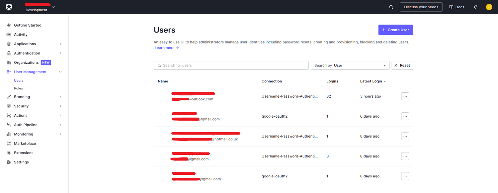
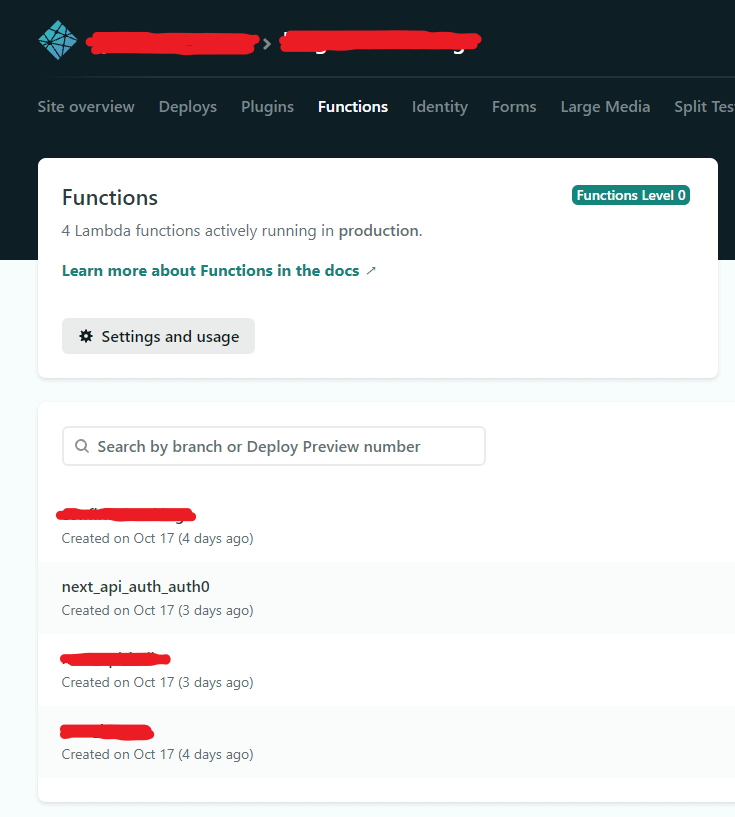

# Introduction

My family recently acquired a static caravan to be shared throughout the year as a place to have a break. My first thought
was

<p class="italic">"This will be great."</p>

And my second thought, like most other software engineers, was

<p class="italic">"I think a custom booking system is in order here."</p>

Jokes aside, something was needed to help coordinate who's in the caravan and when throughout the year, and I
saw this as an opportunity to see how quickly I could get something working in the space of a few evenings, using serverless
technology and SaaS products, with zero setup or operating costs.

I achieved my goal with the help of [Next.js][nextjs-url], [Auth0][auth0-url], [Supabase][supabase-url] and [Netlify][netlify-functions-url]
(for hosting and serverless functions), and it's all written in [TypeScript][typescript-url] too.
Read on to find out more about these technologies and how they helped me achieve my goal.

<div class="flex-images">
    <div class="img-container">
        <div class="img-container-inner">
            
        </div>
    </div>
    <div class="img-container">
        <div class="img-container-inner">
            
        </div>
    </div>
    <div class="img-container">
        <div class="img-container-inner">
            
        </div>
    </div>
    <div class="img-container">
        <div class="img-container-inner">
            
        </div>
    </div>
    <div class="img-container">
        <div class="img-container-inner">
            
        </div>
    </div>
    <div class="img-container">
        <div class="img-container-inner">
            
        </div>
    </div>
</div>

# The Requirements

Aside from the main goals of quick delivery and no cost, I wanted the booking system to have the following features in
order to be as functional and usable as possible:

-   A simple and intuitive UI/UX to make booking as straight-forward as possible for everyone.
-   Full authentication flow with username/password and social login (e.g. Google). Sign-up had to be restricted in some
    way to prevent unwanted sign-ups.
-   A page for showing all future bookings planned in. This would be in a list format ordered chronologically and also in
    a calendar format. This would help family members have some visibility of who is staying over and when, and when there is
    availability for booking a stay.
-   A page showing all booking specific for the logged in user along with a form for booking a new stay. The form would have
    basic validation in place and would allow the user to select the dates using a calendar. The form should not allow duplicate
    bookings to be made.
-   An email confirmation to be sent out on successful booking.
-   Bookings should be able to be deleted. Users can delete their own bookings but not others'.

# Going Serverless


<p class="img-attribute">Source: https://assets2.botmetric.com/wp-content/uploads/2017/10/The-benefits-of-going-serverless-1.png</p>

Serverless technology has become hugely popular since the introduction of Cloud Computing, with developers realising
that the costs, effort and lead times associated with building and maintaining your own server can be drastically reduced.

Serverless is not truly serverless, but its name comes from the perception of the developers who themselves do not need
to think in terms of building and maintaining a server; instead relying on SaaS products and services like [AWS Lambda][aws-lambda-url]
to handle most of the work for them.

Aside from saving time and costs, serverless also helps to mitigate risk and responsibility in certain key areas like
scalability, authentication and GDPR, to name a few.

Going serverless played a significant role in acheiving my main goals for the project - to have something functional in a
short space of time with zero costs.

For more information on serverless technology, Martin Fowler has a [comprehensive article][martin-fowler-serverless-article-url]
on the topic which is a good read.

# Technical Architecture

Below is an overview of all of the tech used and how they each contributed to the goals of the project.

## Next.js

<div class="img-single-small">
    
</div>

Next.js is a React based JavaScript framework for building static and server-side rendered (SSR) applications. I was
looking to build a static site to make use of performance enhancements and cheap and fast web hosting so it seemed like
a sensible choice.

It also had the following in its favour:

-   It supports TypeScript out-of-the-box. From memory, this required little to no initial effort other than supplying a flag
    when using the Create CLI. I'm a big fan of TypeScript, more so in the last 6 months where I have been able to use it
    extensively. Once accustomed to writing in a typed fashion, it requires minimal development overhead and produces
    far more readable code which noticeably suffers from fewer bugs (like passing the wrong type to a third-party library).
-   It is a suitable alternative Framework to Gatsby which I'm already familiar with and a big fan of. I was keen to try
    an alternative to see how it compared.
-   Much like Gatsby, it has nice things like route pre-fetching and image optimisation which contribute to a much better
    user experience when navigating around the app.
-   And finally - built-in support for API routes. This proved to be very useful when integrating with the Auth0 library,
    which I'll come onto next.

## Auth0

<div class="img-single-small">
    
</div>

The application needed to have authentication to control access to the site and to keep track of who had made bookings, but
I didn't want to build any of the sign-up / sign-in flow myself, and I wanted to hand over the responsibility of user
information to an authentication service.

There are numerous options available to do this, including [Netlify Identity][netlify-identity-url] and [Supabase Auth][supabase-auth-url],
but I decided on Auth0 as it had been on my radar to experiment with for a while, and it had a really simple integration
with Next.js apps.

Auth0 was super simple to add into my app, requiring only the following steps to be completed:

-   Sign-up for an Auth0 account on the free tier.
-   Create a new application of the Regular Web Application type.
-   Configure the "Allowed Callback URLs" and "Allowed Logout URLs" in the Application Settings. I included two entries
    for each to enable it to work locally and when deployed to Netlify. E.g. `http://localhost:3000/api/auth/callback` and
    `https://xxxxx.netlify.app/api/auth/callback` for Allowed Callback URLs.
-   Install the Auth0 Next.js integration package from [npm][auth0-npm-url].
-   Add environment variables for the Auth0 secret, base URL, issuer base url, client ID and client secret. These were added
    to both an `.env.local` file as well as in the Environment Variables section in Netlify.
-   Add a new API route file in the Next.js application - `/pages/api/auth/[...auth0].js` which automatically handles the
    creation of all necessary authentication API routes. It simply calls `handleAuth` with some custom config to handle
    redirect on successful login:

```
import { handleAuth, handleLogin } from '@auth0/nextjs-auth0';

export default handleAuth({
    async login(req, res) {
        await handleLogin(req, res, {
            returnTo: '/bookings',
        });
    },
});
```

-   Wrap the main App component in the UserProvider component provided by the Auth0 package. This ensures every
    component can access basic details about the authenticated user like username and email address:

```
import React from 'react';
import type { AppProps } from 'next/app';
import { UserProvider } from '@auth0/nextjs-auth0';

import '../styles/globals.scss';

function MyApp({ Component, pageProps }: AppProps) {
    return (
        <UserProvider>
            <Component {...pageProps} />
        </UserProvider>
    );
}
export default MyApp;
```

-   For each page which should be protected, wrap the exported component function in the `withPageAuthRequired` function
    also provided by the Auth0 package:

```
import React from 'react';
import type { NextPage } from 'next';
import { withPageAuthRequired, useUser } from '@auth0/nextjs-auth0';

import styles from '../styles/Bookings.module.scss';

const Bookings: NextPage = () => {
    const { user } = useUser(); // The logged in user's profile.

    return (
        <div className={styles.bookings}>{/* Code removed for brevity */}</div>
    );
};

export default withPageAuthRequired(Bookings);
```

And that's it - some account setup and a few code changes and the application is protected by a fully functioning
authentication mechanism. Auth0 handles the rendering of the login form (which can be customised), sign-up can be turned
off to help prevent unwanted users registering, and Auth0 maintains the user details which can be found in the Auth0 dashboard.



A lot of the magic happens in the `/pages/api/auth/[...auth0].js` file, specifically the call to `handleAuth`.

The use of `[...auth]` in the file name declares the file as a [catch-all, dynamic route handler][auth0-nextjs-catch-all-route-handler-url],
allowing it to match to all routes within `/api/auth/`. Calling `handleAuth1` transparently creates route handlers which
each perform some function in the auth flow, like `/api/auth/login` and `/api/auth/logout`.

Next.js has support for building [API routes][nextjs-api-routes-url] which are serverless Node.js functions designed to
respond to HTTP requests. This allows developers to create simple full-stack applications right within the Next.js
framework. API files are created within the `./pages/api/` directory and do not end up in the final client-side bundle.

When hosted on Netlify, each API route becomes a Netlify Function. This wasn't immediately obvious to me, mainly due to the
fact that this required no special configuration, and the Functions just started to work once the app was deployed.



Authentication is normally stressful and time-consuming to implement, but Auth0 took all of the complexity away,
and the Auth0 Next.js package made the process even easier, all whilst still resulting in a really good user experience.
[nextjs-url]: https://nextjs.org/
[typescript-url]: https://www.typescriptlang.org/
[auth0-url]: https://auth0.com/
[supabase-url]: https://supabase.io/
[netlify-functions-url]: https://www.netlify.com/products/functions/
[martin-fowler-serverless-article-url]: https://martinfowler.com/articles/serverless.html
[aws-lambda-url]: https://aws.amazon.com/lambda/
[netlify-identity-url]: https://www.netlify.com/pricing/#add-ons-identity
[supabase-auth-url]: https://supabase.io/auth
[auth0-npm-url]: https://www.npmjs.com/package/@auth0/nextjs-auth0
[auth0-nextjs-tutorial]: https://auth0.com/docs/quickstart/webapp/nextjs/01-login
[github-auth0-nextjs-tutorial]: https://github.com/auth0/nextjs-auth0
