# Introduction

We recently acquired a holiday home in the family to be shared throughout the year as a place to have a break. My first thought
was:

<p class="italic">"This will be great."</p>

And my second thought, like most other software engineers, was:

<p class="italic">"I think a custom booking system is in order here."</p>

Jokes aside, something was needed to help coordinate who's in the holiday home and when throughout the year, and I saw
this as an opportunity to see how quickly I could get something working in the space of a few evenings, using serverless
technology and <span class="bold">\*</span>aaS (mostly Backend as a Service) solutions, with zero setup or operating costs.

I achieved my goal with the help of [Next.js][nextjs-url], [Auth0][auth0-url], [Supabase][supabase-url] and [Netlify][netlify-functions-url]
(for web hosting and serverless functions), and it's all written in [TypeScript][typescript-url] too.
Read on to find out more about these technologies and how they helped me achieve my goal.

<div class="flex-images">
    <div class="img-container">
        <div class="img-container-inner">
            
        </div>
    </div>
    <div class="img-container">
        <div class="img-container-inner">
            
        </div>
    </div>
    <div class="img-container">
        <div class="img-container-inner">
            
        </div>
    </div>
    <div class="img-container">
        <div class="img-container-inner">
            
        </div>
    </div>
    <div class="img-container">
        <div class="img-container-inner">
            
        </div>
    </div>
    <div class="img-container">
        <div class="img-container-inner">
            
        </div>
    </div>
</div>

# The Requirements

Aside from the main goals of quick delivery and no cost, I wanted the booking system to have the following features in
order to be as functional and usable as possible:

-   A simple and intuitive UI/UX to make booking as straight-forward as possible for everyone.
-   Full authentication flow with username/password as well as social login (e.g. Google). Sign-up had to be restricted in some
    way to prevent unwanted sign-ups.
-   A page for showing all future bookings planned in. This would be in a list format ordered chronologically and also in
    a calendar format. This would help family members have some visibility of who is staying over and when, and when there is
    availability for making a new booking.
-   A page showing all future bookings made by the logged-in user, along with a form for making a new booking. The form
    would have basic validation in place and would allow the user to select the check-in and check-out dates using a calendar.
    The form should not allow duplicate bookings to be made.
-   An email confirmation to be sent out on successful booking.
-   Bookings should be able to be deleted. Users can delete their own bookings but not others'.

# Going Serverless


<p class="img-attribute">Source: https://assets2.botmetric.com/wp-content/uploads/2017/10/The-benefits-of-going-serverless-1.png</p>

Serverless technology has become hugely popular since the introduction of Cloud Computing, with developers realising
that the costs, effort and lead times associated with building and maintaining your own server and infrastructure can be
drastically reduced.

Serverless is not truly serverless, but its name comes from the perception of the developers who themselves do not need
to think in terms of building and maintaining a server; instead relying on <span class="bold">\*</span>aaS products and
services like [AWS Lambda][aws-lambda-url] to handle most of the work for them.

Aside from saving time and costs, serverless also helps to mitigate risk in important areas like scalability, availability,
authentication and security, to name a few.

Going serverless played a significant role in acheiving my main goals for the project.

# Technical Architecture

Below is an overview of the tech used and how they each contributed to the goals of the project.

## Next.js

<div class="img-single-small">
    
</div>

Next.js is a React based JavaScript framework for building static and server-side rendered (SSR) applications. I was
looking to build a static site to benefit from performance optimisations and use cheap and fast web hosting, so it seemed
like a sensible choice.

It also had the following in its favour:

-   It supports TypeScript out-of-the-box. From memory, this required little to no initial effort other than supplying a flag
    when using the [Create Next App CLI][nextjs-create-app-url]. I'm a big fan of TypeScript, more so in the last six months
    where I have been able to use it extensively. Once accustomed to writing in a typed fashion, it results in little development
    overhead but produces far more readable code which noticeably suffers from fewer bugs (like passing the wrong type to
    a third-party library).
-   It is a suitable alternative Framework to [GatsbyJS][gatsbyjs-url] which I'm already familiar with and a big fan of. I was keen to try
    an alternative to see how it compared.
-   Much like GatsbyJS, it has nice things like route pre-fetching and image optimisation which contribute to a much better
    user experience when navigating around the app.
-   And finally - Next.js has built-in support for creating back-end API routes in Node.js. This proved to be very useful when integrating
    with the Auth0 library, which I'll come onto next.

## Auth0

<div class="img-single-small">
    
</div>

The application needed to have authentication to control access to the site and to keep track of who had made bookings, but
I didn't want to build any of the sign-up / sign-in flow myself, and I wanted to hand over the responsibility of storing user
information to an authentication service.

There are numerous "Authentication as a Service" options available to do this, including [Netlify Identity][netlify-identity-url]
and [Supabase Auth][supabase-auth-url], but I decided on [Auth0][auth0-url] as it had been on my radar to experiment with for a while,
and it has a really handy [npm package][auth0-npm-url], written in TypeScript also, for simple integration with Next.js apps.

Auth0 was super simple to add into my app, requiring only the following steps to be completed:

-   Sign-up for an Auth0 account on the free tier.
-   Create a new application of the Regular Web Application type.
-   Configure the "Allowed Callback URLs" and "Allowed Logout URLs" in the Application Settings. I included two entries
    for each to enable it to work locally and when deployed to Netlify. E.g. `http://localhost:3000/api/auth/callback` and
    `https://xxxxx.netlify.app/api/auth/callback` for Allowed Callback URLs.
-   Install the Auth0 Next.js integration package from [npm][auth0-npm-url].
-   Add environment variables for the Auth0 secret, base URL, issuer base url, client ID and client secret. These were added
    to both a `.env.local` file as well as in the Environment Variables section in Netlify.
-   Add a new API route file in the Next.js application - `pages/api/auth/[...auth0].ts` - which automatically handles the
    creation of all necessary authentication API routes. It simply calls `handleAuth` with some custom config to handle a
    redirect on successful login:

```
// file: pages/api/auth/[...auth0].ts

import { handleAuth, handleLogin } from '@auth0/nextjs-auth0';

export default handleAuth({
    async login(req, res) {
        await handleLogin(req, res, {
            returnTo: '/bookings',
        });
    },
});
```

-   Wrap the main App component in the `UserProvider` component provided by the Auth0 package. This ensures every
    component can access basic details about the authenticated user like username and email address:

```
// file: pages/_app.tsx

import React from 'react';
import type { AppProps } from 'next/app';
import { UserProvider } from '@auth0/nextjs-auth0';

import '../styles/globals.scss';

export default function MyApp({ Component, pageProps }: AppProps) {
    return (
        <UserProvider>
            <Component {...pageProps} />
        </UserProvider>
    );
}
```

-   For each page which should be protected, wrap the exported component function in the `withPageAuthRequired` function
    also provided by the Auth0 package:

```
// file: pages\bookings.tsx

import React from 'react';
import type { NextPage } from 'next';
import { withPageAuthRequired, useUser } from '@auth0/nextjs-auth0';

import styles from '../styles/Bookings.module.scss';

const Bookings: NextPage = () => {
    const { user } = useUser(); // The logged in user's profile.

    return (
        <div className={styles.bookings}>{/* Code removed for brevity */}</div>
    );
};

export default withPageAuthRequired(Bookings);
```

And that's it - some account setup and a few code changes and the application is protected by a fully functioning
authentication mechanism. Auth0 handles the rendering of the login form (which can be customised), sign-up can be turned
off to help prevent unwanted users registering, and Auth0 maintains the user details which can be found in the Auth0 dashboard
as shown below.


A lot of the magic happens in the `pages/api/auth/[...auth0].ts` file, specifically the call to `handleAuth`.

Next.js has support for building [API routes][nextjs-api-routes-url] which are serverless Node.js functions designed to
respond to HTTP requests. This allows developers to create simple full-stack applications right within the Next.js
framework. API files are created within the `pages/api/` directory and do not end up in the final client-side bundle.

The use of `[...auth0]` in the file name declares the file as a [catch-all, dynamic route handler][auth0-nextjs-catch-all-route-handler-url],
allowing it to match to all routes within `/api/auth/`. Calling `handleAuth` transparently creates route handlers which
each perform some function in the auth flow, like `/api/auth/login` and `/api/auth/logout`.

When hosted on Netlify, each API route becomes a [Netlify Function][netlify-functions-url]; this wasn't immediately
obvious to me, mainly due to the fact that this required no special configuration, and the Functions just started to work
once the app was deployed.


Authentication is normally stressful and time-consuming to implement, but Auth0 took all of the complexity away,
and the Auth0 Next.js package made the process even easier, all whilst still resulting in a really good user experience.

For more information on integrating Auth0 with Next.js, I'd recommend looking at the [package docs on GitHub][github-auth0-nextjs-tutorial]
and also [this Auth0 quickstart tutorial][auth0-nextjs-tutorial].

## Supabase

<div class="img-single-small">
    
</div>

[Supabase][supabase-url] is another "Backend as a Service" which I have had my eye on for a little while, and has been
growing hugely in popularity recently, so I wanted to give it a try as my data storage mechanism for the bookings.

Along with offering a few other features, it allows developers to quickly provision [Postgres][postgres-url] databases,
all hosted and managed for them. There is a free-tier plan which is fairly limited, most notably because:

-   It is limited to 500MB of space per database - not a big deal for this project.
-   It will "pause" the database after 1 week of inactivity, which essentially shuts down the database and is only re-activated
    after a login to the Supabase dashboard. This actually isn't all that ideal for me, as I expect database interactivity
    to be quite sporadic throughout the year, so this may be the source of some pain, but I'll keep an eye on it.

Creating a database was very straightforward, and only required the following steps through the dashboard:

-   Create an account.
-   Create a new organisation.
-   Create a new database project, choosing a project name, database password and a hosting region.

And from there you can add your tables as required. For the booking system, I needed two tables, one to hold the bookings
and another to hold some non-sensitive user mapping details.

The database can be queried right from the front-end application using the [Supabase npm package][supabase-npm-url],
supplying the `NEXT_PUBLIC_SUPABASE_URL` and `NEXT_PUBLIC_SUPABASE_ANON_KEY` when instantiating the client to be used for
all requests:

```
// file: lib/initSupabase.ts

import { createClient } from '@supabase/supabase-js';

export const supabase = createClient(
    process.env.NEXT_PUBLIC_SUPABASE_URL,
    process.env.NEXT_PUBLIC_SUPABASE_ANON_KEY
);
```

Requests can then be simply made like so:

```
// file: lib/repository.ts

import dayjs from 'dayjs';
import utc from 'dayjs/plugin/utc';

import { supabase } from './initSupabase';
import Booking from '../data/models/booking';

dayjs.extend(utc);

export const fetchBookings = async ({
    match = {},
}: {
    match?: { user_nickname?: string };
}): Promise<Array<Booking>> => {
    const today = dayjs.utc();

    let { data: bookings, error } = await supabase
        .from('bookings')
        .select('*')
        .match(match)
        .order('check_in', { ascending: true })
        .gte('check_out', today.toISOString());

    if (error) throw error;
    if (bookings === null) throw new Error('Bookings were unexpectedly null.');

    return bookings.map((booking) => {
        // Code removed for brevity.
    });
};
```

The above will return all bookings which match a supplied filter and where checkout is on or after the current date,
sorted by check-in date ascending.

It seemed strange at first to query a database directly from the client code, but Tables in Supabase and the data within
them can be locked down on a very granular level using Row Level Security and Postgres Policies. See the [Auth docs][supabase-auth-url]
for more information.

## Netlify Hosting

<div class="img-single-small">
    
</div>

At this point I had a nice looking booking application with authentication and data storage all setup, so I was looking
at hosting options. Obviously I wanted to steer clear of provisioning my own web server and handling the configuration myself
because I wanted something quick to setup with zero costs, and frankly, there are some awesome "Platform as a Service"
hosting platforms out there like [Netlify][netlify-url], [Vercel][vercel-url] and [Heroku][heroku-url].

I have used Netlify countless times now and I have only positive things to say about it. It has a very generous free plan,
excellent documentation, lots of cool features, and offers an all-round excellent developer experience. It also has solid
compatibility with Next.js sites - more on this in the next section.

## Netlify Functions (AWS Lambda) + Twilio

<div class="img-single-small">
    
</div>

I touched on Netlify functions earlier in the Auth0 section, but they were mostly set up implicitly when using the Auth0
Next.js npm package.

I had a requirement to send a confirmation email once a booking had been made. [Twilio Sendgrid][twilio-sendgrid-url] is a
"Communications Platform as a Service" with a generous free plan offering up to 100 emails a day - more than enough for this project.
I have used Twilio Sendgrid numerous times before to programmatically send emails and have always been happy, so this was an easy decision to make.

With Twilio selected, I needed some way of calling the APIs to send confirmation emails. This can't be done directly from
the Next.js client side application, as that would expose the sensitive Twilio Sendgrid API key; instead a backend was needed
which could be called over HTTP and would in turn make the calls to Twilio.

I was interested in creating my own Netlify Function, which under the hood uses an AWS Lambda function, as there is also
a generous free tier available, and it would also help keep all of the serverless functions in one place. Netlify Functions
can be written in TypeScript, and can be easily tested locally before deployment using the [Netlify Dev CLI][netlify-dev-url].

I created a new file to hold the logic of the function - `netlify/functions/confirm-booking.ts` - with the following
contents:

```
// file: netlify/functions/confirm-booking.ts

import { Handler } from '@netlify/functions';
import sgMail from '@sendgrid/mail';

interface Booking {
    // Code removed for brevity.
}

const getBookingDetailsHtmlContent = ({
    guestsDescription,
    checkIn,
    checkOut,
}: Booking) => {
    // Code removed for brevity.

    return content;
};

const confirmBookingHandler: Handler = async (event) => {
    // Code removed for brevity.

    sgMail.setApiKey(process.env.SENDGRID_API_KEY);

    const booking: Booking = JSON.parse(event.body);
    const email = {
        to: booking.email,
        from: fromEmail,
        subject: 'Tree Top Park: Your Booking Has Been Made',
        html: `Hi ${booking.nickname},
                <br /><br />
                Your booking has been made with the following details:
                <br /><br />
                ${getBookingDetailsHtmlContent(booking)}`,
    };

    try {
        await sgMail.send(email);
    } catch (err) {
        return {
            statusCode: 500,
            body: 'There was a problem sending the email.',
        };
    }

    return {
        statusCode: 204,
    };
};

exports.handler = confirmBookingHandler;
```

The function makes use of the [Netlify Functions][netlify-functions-npm-url] and [Sendgrid/Twilio][sendgrid-twilio-npm-url]
npm packages - both typed, and easy to use.

I first tested my function locally using the [Netlify Dev CLI][netlify-dev-url] which allowed me to quickly verify its
implementation and fix a few issues. I then added a new environment variable to Netlify for the `SENDGRID_API_KEY` and pushed
my changes to the `main` branch. This triggered a build and deployment in Netlify, at which point my new function was picked up
and deployed straight away without trouble. Confirmation emails had now been added to the booking system.

# The End Result

I easily met my main goals of delivering quickly and with zero setup or operating costs. With about five hours spent across
a couple of evenings, I had ticked off all requirements of the booking system I set out to complete, with the majority of
that time spent on the development of React components and making the front-end responsive, as it would mostly be used on mobile devices.

I'm really pleased with the end result, and it's proving to be useful already. All of the tech mentioned have been great to
work with and would certainly be on my list to use again.

## Screenshots

See below for some screenshots of the finished product (test data used).

### Home

<div class="image-thin-border-container">
    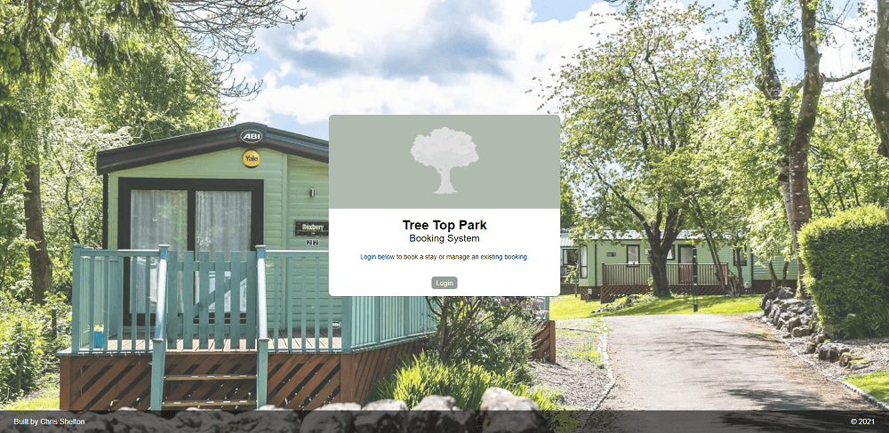
</div>
<p class="img-attribute">Home screen on desktop.</p>

<div class="image-thin-border-container">
    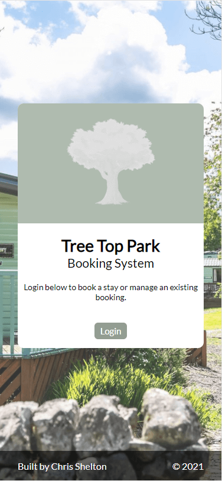
</div>
<p class="img-attribute">Home screen on mobile.</p>

### Auth0 Login

<div class="image-thin-border-container">
    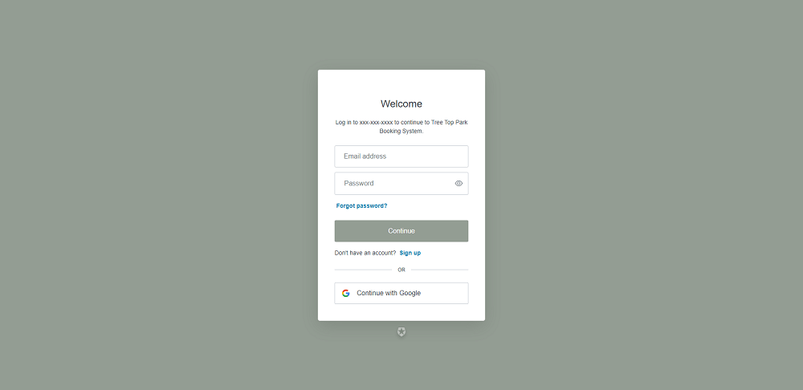
</div>
<p class="img-attribute">Auth0 login screen on desktop.</p>

<div class="image-thin-border-container">
    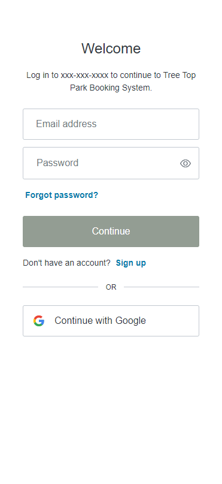
</div>
<p class="img-attribute">Auth0 login screen on mobile.</p>

### All Bookings - List View

<div class="image-thin-border-container">
    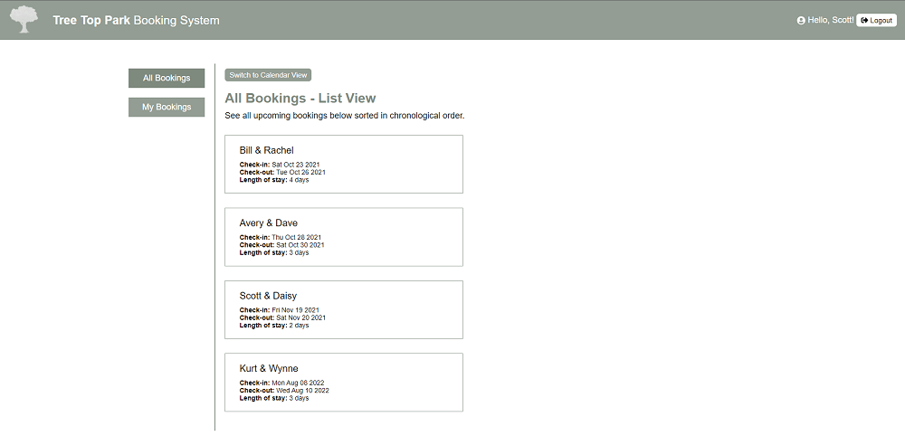
</div>
<p class="img-attribute">All bookings displayed in the list view on desktop.</p>

<div class="image-thin-border-container">
    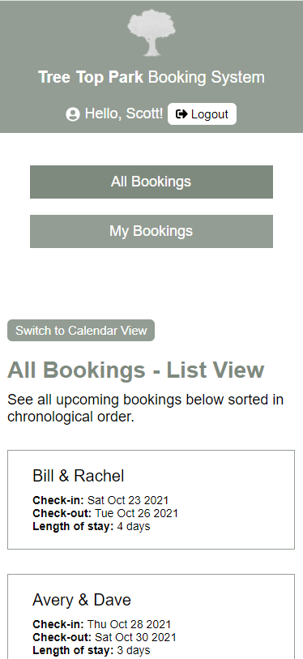
</div>
<p class="img-attribute">All bookings displayed in the list view on mobile.</p>

### All Bookings - Calendar View

<div class="image-thin-border-container">
    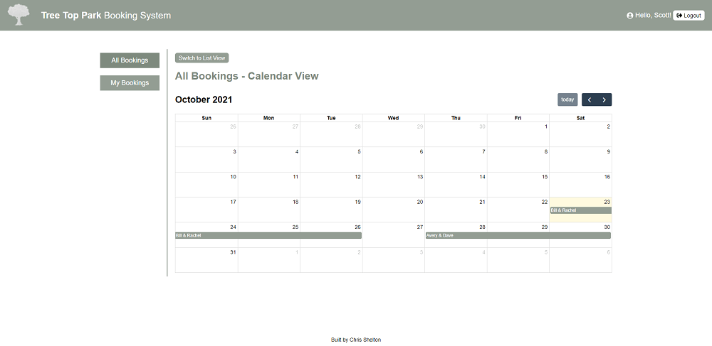
</div>
<p class="img-attribute">All bookings displayed in the calendar view on desktop.</p>

<div class="image-thin-border-container">
    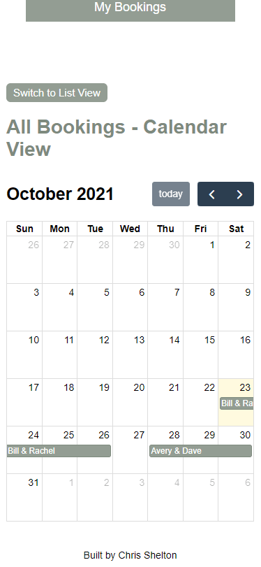
</div>
<p class="img-attribute">All bookings displayed in the calendar view on mobile.</p>

### My Bookings - List View

<div class="image-thin-border-container">
    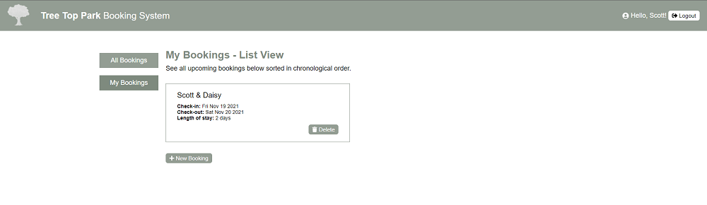
</div>
<p class="img-attribute">My bookings displayed in the list view on desktop.</p>

<div class="image-thin-border-container">
    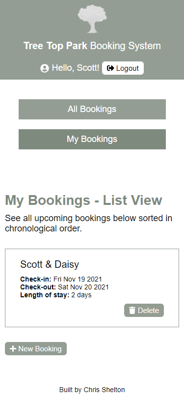
</div>
<p class="img-attribute">My bookings displayed in the list view on mobile.</p>

### Creating a New Booking

<div class="image-thin-border-container">
    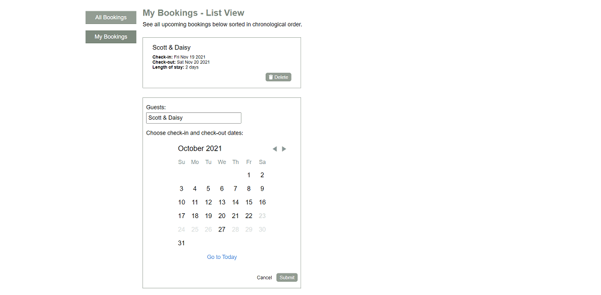
</div>
<p class="img-attribute">Creating a new booking on desktop.</p>

<div class="image-thin-border-container">
    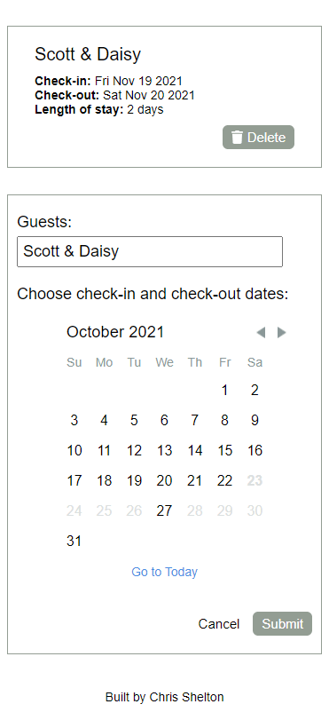
</div>
<p class="img-attribute">Creating a new booking on mobile.</p>

### Confirmation Email

<div class="image-thin-border-container">
    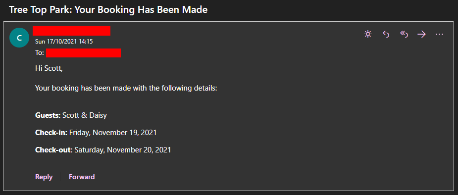
</div>
<p class="img-attribute">Confirmation email received after completing a booking.</p>

[nextjs-url]: https://nextjs.org/
[nextjs-create-app-url]: https://nextjs.org/docs/api-reference/create-next-app
[gatsbyjs-url]: https://www.gatsbyjs.com/
[typescript-url]: https://www.typescriptlang.org/
[auth0-url]: https://auth0.com/
[supabase-url]: https://supabase.io/
[netlify-functions-url]: https://www.netlify.com/products/functions/
[aws-lambda-url]: https://aws.amazon.com/lambda/
[netlify-identity-url]: https://www.netlify.com/pricing/#add-ons-identity
[supabase-auth-url]: https://supabase.io/auth
[auth0-npm-url]: https://www.npmjs.com/package/@auth0/nextjs-auth0
[auth0-nextjs-tutorial]: https://auth0.com/docs/quickstart/webapp/nextjs/01-login
[github-auth0-nextjs-tutorial]: https://github.com/auth0/nextjs-auth0
[auth0-nextjs-catch-all-route-handler-url]: https://nextjs.org/docs/api-routes/dynamic-api-routes#catch-all-api-routes
[nextjs-api-routes-url]: https://nextjs.org/docs/api-routes/introduction
[supabase-npm-url]: https://www.npmjs.com/package/@supabase/supabase-js
[supabase-auth-url]: https://supabase.io/docs/learn/auth-deep-dive/auth-row-level-security
[netlify-url]: https://www.netlify.com/
[vercel-url]: https://vercel.com/
[heroku-url]: https://www.heroku.com/
[postgres-url]: https://www.postgresql.org/
[netlify-dev-url]: https://www.netlify.com/products/dev/
[netlify-functions-npm-url]: https://www.npmjs.com/package/@netlify/functions
[sendgrid-twilio-npm-url]: https://www.npmjs.com/package/@sendgrid/mail
[twilio-sendgrid-url]: https://sendgrid.com/
