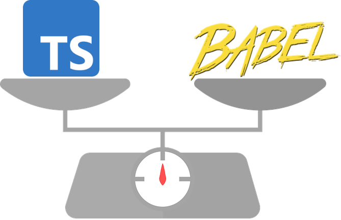
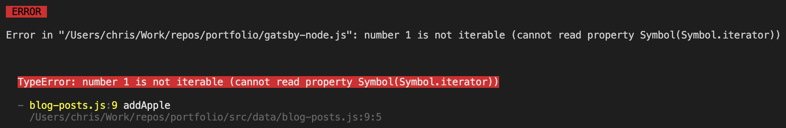
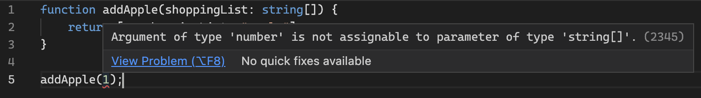
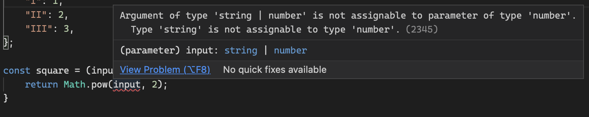
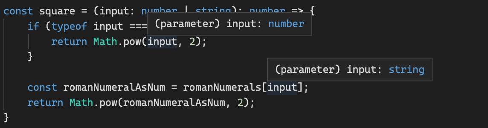

# Introduction

<div class="img-single-small">
  
</div>

JavaScript is not a [statically typed][statically-typed-url] language, it is [dynamically typed][dynamically-typed-url], meaning the types of variables (and other constructs in the language) are not checked until the time of code execution, i.e. after the code has been written and is running in the browser or Node.js environment. Variables in statically typed languages like C#, Java and Go, however, have their types checked before the code is executed, typically during a compilation step.

JavaScript, being a dynamically typed language, suffers from only getting type errors late in the development cycle when compared to statically typed languages. This leads to mistakes in the code, often simple ones, that could otherwise have been prevented by a quicker feedback loop on how types are being used.

TypeScript helps bridge this gap in JavaScript, bringing type safety to a language which was created over [25 years ago][javascript-info-url]. JavaScript has since [matured][javascript-maturity-url] and become [one of the most popular programming languages][javascript-popularity-url] in recent years for all kinds of application development, so the introduction of type safety was a welcome adaptation to the language for many developers.

# TypeScript

Due to the lack of static typing, writing JavaScript can sometimes feel like guesswork, especially to those less experienced with the language, or when you're working with third-party libraries. Only when you run your code do you realise you got some syntax wrong.

When using TypeScript, you feel more confident that what you have written will work as you expect; you spend less time checking how something should be called and more time solving the problem at hand.

## The TypeScript Compiler

<div class="img-single-medium">
  
</div>

JavaScript engines, like Google's [V8][google-v8-url] which is used in Chrome and Node.js, cannot execute TypeScript code; it must first be compiled, or more accurately transpiled, into JavaScript code.

The [TypeScript compiler][typescript-compiler-npm-url] is responsible for converting TypeScript code to its equivalent JavaScript code which can then be executed. This compilation process does a few things, most notably:

-   Removing all of the type information you worked so hard on adding and maintaining during development. Remember, TypeScript is purely a development tool to help us write better JavaScript, and has no direct impact on the code when it's being executed.
-   Downlevelling (often referred to as transpiling) the JavaScript code to a desired ECMAScript version through the [target][typescript-target-config-url] config option. Downlevelling is the process of altering the JavaScript code to ensure that it can safely run in your target environments.

The TypeScript compiler can easily fit into a Webpack workflow using the [ts-loader][ts-loader-url], and even comes pre-installed and configured when using libraries like [Create React App][create-react-app-typescript-url] and [Vue CLI][vue-cli-typescript-url].

### What About Babel?

<div class="img-single-medium">
  
</div>

The TypeScript compiler and [Babel][babeljs-url] are very similar tools, and often you can choose one or the other - they are both capable of TypeScript to JavaScript compilation and JavaScript downlevelling.

**However, there is a key difference** - Babel cannot type check TypeScript code, it can only convert it to its JavaScript equivalent; you would still need to use the TypeScript compiler to verify your usage of types.

Unless you're developing an application which requires the use of Babel, I'd recommend just using the TypeScript compiler.

## Is TypeScript its Own Language?

This is quite a common misunderstanding for those new to TypeScript, and can be one of a few factors which deters developers from picking up TypeScript - the expectation that they will need to invest many more hours learning a new language, with new syntax to get familiar with and with its own quirks to understand.

Yes - TypeScript is its own programming language, but that's quite a misleading statement. TypeScript is developed and maintained by Microsoft and is [described as][typescript-url] "a strict syntactical superset of JavaScript" which "adds optional static typing to the language".

So really it can be thought of more as an adaptation of the JavaScript language, with some nice optional extras - most notably type safety. If you know JavaScript you can very quickly start writing TypeScript code, and TypeScript code will look very familiar to you - functions look largely the same and you'll still use things like `let` and `const` to declare variables.

"a strict syntactical superset of JavaScript" means that strictly all JavaScript code is valid TypeScript code. This is important as it means TypeScript can be adopted incrementally, and a project can have a mixture of both JS and TS files at any one time; you can use as much or as little as you want from TypeScript.

## A Simple Example

Below is a trivial example of JavaScript and its TypeScript equivalent, with an obvious flaw meaning it will always fail at runtime. Here, we try to add a new item to an array parameter using the [spread operator][spread-operator-url]. Further examples in this post will cover some more realistic and less obvious type errors which TypeScript can help us with.

```
function addApple(shoppingList) {
    return [...shoppingList, "apple"];
}

addApple(1);
```

If you were to execute the JavaScript code above, you would be met with a `TypeError`, because we've tried to call the spread operator on the number 1, rather than something which is an iterable (specifically an array in this case). There is no**\*** early feedback telling us that we're misusing the `addApple` function until we actually use it, and then it falls over with the error below:

<div class="image-thin-border-container">
  
</div>
<p class="img-attribute">We only find out that there is a TypeError when the function is executed.</p>

Below is the TypeScript equivalent. Note the only difference is the use of `: string[]` to specify what type we expect `shoppingList` to be.

```
function addApple(shoppingList: string[]) {
    return [...shoppingList, "apple"];
}

addApple(1);
```

The above example fails when running through the TypeScript compiler, and even gives us the error in the IDE right as the code is being written. Intellisense is also available to inform us how to use the function.

<div class="image-thin-border-container">
  
</div>
<p class="img-attribute">We get an early warning in the IDE that the function is not being used correctly.</p>

<div class="image-thin-border-container">
  
</div>
<p class="img-attribute">We get intellisense for the function to inform us how it should be called.</p>

**\*** There is an exception to this when using some IDEs like VSCode which is discussed in a later section.

# TypeScript Fundamentals

## Types

TypeScript understands all of the primitive values built-in to JavaScript, including the more common ones like `number` and `string`, and those used less common like `bigint` and `symbol`.

It also understands objects, undoubtedly the most popular data type used in JavaScript, and can distinguish at compile time between objects, functions and arrays, which are all fundamentally objects in JavaScript. TypeScript also lets you create your own custom object types with a custom name using types and interfaces - more on this in the next section.

## Type Aliases and Interfaces

Custom types can be defined either using the `type` or `interface` keywords. If you have used a strongly typed language like C# or Java before, you should be familiar with an interfaces being a contract which describes the structure of an object. A type is not much different, and that is a cause of confusion with the language - even the [TypeScript documentation][typescript-handbook-types-vs-interfaces-url] fails to concisely detail when to use one over the other, and mentions "for the most part, you can choose based on personal preference".

Some of the key differences include:

-   Interfaces can be extended to add fields to its structure (known as declaration merging), but types cannot.
-   Interfaces cannot be defined as a primitive value, but types can (e.g. `type SanitizedString = string`).
-   In certain scenarios, using interfaces over types will yield more useful and concise type error messages.

For lack of a clear way to really distinguish which to go with, the documentation recommends that interfaces should be used by default unless there is a need to use the features of a type. This is generally what I've been following, though there are some occasions where using a type just feels more natural, like defining

## Type System

JavScript is a duck typed language meaning no type checks are performed prior to the code running, and when it runs, it will try execute whatever it can on the objects supplied, regardless of their type or structure. TypeScript uses structural typing, meaning it determines types based on their structure - what properties and functions an object has, and these type checks happen at compile time, not runtime.

More on these typing systems below.

### Duck Typing

<div class="img-single-small">
  
</div>

A duck typed language is one which performs no type checks at compile time, only at runtime when code is being executed. And those runtime type checks only check the shape of an object - if you're trying to access a property or call a function on an object, and it's there, then it will work just fine, regardless of how that object was created or what else exists on it. Dynamically typed languages use duck typing.

[Duck typing][duck-typing-wikipedia-url] gets its name from the duck test - "If it walks like a duck and it quacks like a duck, then it must be a duck".

By this definition, JavaScript is a duck typed language, which can easily be demonstrated with the example below:

```
const house = {
    lock: () => console.log("Front door locked!"),
    openGarageDoor: () => console.log("Garage door opened!"),
};

const car = {
    lock: () => console.log("Driver door locked!"),
    start: () => console.log("Car started!"),
};

const lockHouse = (house) => house.lock();

lockHouse(house);   // "Front door locked!"
lockHouse(car);     // "Driver door locked!"
```

This example runs just fine, logging out the locked messages for `house` and `car`. The `lockHouse` function doesn't care what object is passed to it, nor what else exists on it, as long as that object has a `lock` function it can call. For this example, the `car` object matches the behaviour and structure expected by the `lockHouse` function, so as far as it's concerned - a car is a house &#129300;&hellip;

However, **this code is fragile** and can easily result in runtime errors. If the implementation of `lockHouse` were to change and now call `house.openGarageDoor()` instead, then it would result in a runtime TypeError when `lockHouse` is called with `car`. Structural typing solves this problem for us.

### Structural Typing

<div class="img-single-small">
  
</div>

Structural typing, as used in TypeScript, builds on top of duck typing by validating how types are used at compile time. It uses the same principle as duck typing, whereby type compatibility is determined based on shape (the properties and functions available), but it aims to further validate that there's enough structural overlap between the type being used and what's expected; if there is, then compatibility is ensured and TypeScript is happy.

To demonstrate this, see the example below.

```
// Declare Car and House types.
type Car = {
    wheelCount: number;
    doorCount: number;
    lock: () => void;
}

type House = {
    doorCount: number;
    lock: () => void;
}

// Create an object of each type.
const car: Car = {
    wheelCount: 4,
    doorCount: 5,
    lock: () => console.log('Car locked!')
}

const house: House = {
    doorCount: 3,
    lock: () => console.log("House locked!")
}

// Create a locking function for each type.
const lockHouse = (house: House) => house.lock();
const lockCar = (car: Car) => car.lock();

// Attempt to pass both objects to the `lockHouse` function. All OK.
lockHouse(house);
lockHouse(car);

// Attempt to pass both objects to the `lockVehicle` function. We get a Type Error.
lockCar(car);
lockCar(house); // Type Error
```

In this example, two types are being declared - `Car` and `House`, and an object is created for each of these types. As you can see, there is some structural overlap between these two types - they both have a `doorCount` property and a `lock` function. However, there is an additional property on a Car - `wheelCount` - which is causing the TypeError.

There is sufficient overlap between `Car` and `House` such that `lockHouse` can accept the `Car` type, but `lockCar` cannot accept the `House` type. In other words, `Car` can be seen as a subtype of `House`, meaning wherever a house is expected, we can also pass a car.

This only works because of the overlap in properties and functions - `Car` has at least all of the properties and functions of `House`, but `House` does not have the `wheelCount` so it does not sufficiently overlap with `Car`.

Looking at the Type Error in more detail, it's telling us exactly this: `TypeError - Argument of type 'House' is not assignable to parameter of type 'Car'. Property 'wheelCount' is missing in type 'House' but required in type 'Car'.`

### Nominal Typing (Name-based)

Most traditional statically typed languages like C# and Java are nominally typed, meaning the identity of the type itself is important, not just whether types share the same properties and behaviour.

In C# for example, if you have two interfaces which are identical in their structure, they still cannot be used interchangeably, because they fundamentally identify as different types through their name. Back to the Car and House example - they are named differently and so are not equivalent types in nominal type systems.

## Module Imports

TypeScript has support for all different module types, but is opinionated towards ES Modules (ESM) as defined in ECMAScript 2015 (ES6) - using the `import` and `export` keywords. A new TypeScript project typically comes with default settings to allow support for working with ESM over other module systems like CommonJS.

TypeScript, being a transpiler, is able to treat CommonJS modules (and other module types) similar to ESM. This is really powerful as is allows for ESM import syntax to be used when working with CommonJS libraries in Node, like `fs` for example:

```
// Using an ESM import statement
import fs from 'fs';

// Rather than the more traditional Node CommonJS import statement
const fs = require('fs');
```

This may be seen as a subtle advantage, but it really does help drive more consistency in the code you write, especially when developing on a codebase meant for multiple environments, like the browser and Node.js for example. For more information on this interoperability between different module systems in TypeScript, see the [documentation on the `esModuleInterop` flag][typescript-esmoduleinterop-url].

## Type Narrowing

Type narrowing is the process of refining a type down to one which is more specific than originally declared. Type narrowing is useful when dealing with union types (types made up of multiple types) and types with optional fields (those which could be undefined), helping you to control the flow of your code through different paths.

There are multiple ways to narrow types, but one of the most common is by using a type guard which uses conditional branches to work on more specific types. See the example below to see a type guard in action.

This example declares a `square` function which squares the input value provided to it, but the input can either be a number or a string, where the string can be the Roman numeral representation of an integer number. To represent this, the input function declares an input parameter with a union type of `number | string`.

```
// Trivial way of converting a Roman numeral to a number.
const romanNumerals: Record<string, number> = {
    "I": 1,
    "II": 2,
    "III": 3,
};

const square = (input: number | string): number => {
    return Math.pow(input, 2);
}
```

Without the use of a type guard to narrow the type of `input`, TypeScript tells us that we can't simply call `Math.pow` with `input` because it could be a string, and that's not a valid use of the `pow` function; it expects a `number` only. TypeScript gives us this error:



To fix this and help the TypeScript compiler, a type guard can be used to conditionally handle the different types in the union:

```
const romanNumerals: Record<string, number> = {
    // Removed for brevity.
};

const square = (input: number | string): number => {
    if (typeof input === "number") { // TypeGuard
        return Math.pow(input, 2);
    }

    const romanNumeralAsNum = romanNumerals[input];
    return Math.pow(romanNumeralAsNum, 2);
}
```

The type guard allows us to have conditional logic based on the type of `input`. If `input` is a number, then TypeScript knows that within the `if` block, `input` has to be a `number` and so it can safely call `Math.pow`. If the type check fails, then TypeScript knows it must be a `string`, and so we convert to the number equivalent of the Roman numeral and then call `Math.pow`.

If we hover over `input` in the different code branches, TypeScript gives us the actual type it has narrowed down to and not the union type, thanks to the type guard.



Type guards can be more complex than this, and can instead use other ways of determining the type of a variable, including using the `instanceof` keyword or by having a special `kind` property on your custom object types. See the [TypeScript Handbook][typescript-handbook-type-narrowing-url] for a more detailed look into type narrowing.

[statically-typed-url]: https://en.wikipedia.org/wiki/Type_system#Static_type_checking
[dynamically-typed-url]: https://en.wikipedia.org/wiki/Type_system#Dynamic_type_checking_and_runtime_type_information
[javascript-popularity-url]: https://pypl.github.io/PYPL.html
[javascript-maturity-url]: https://en.wikipedia.org/wiki/JavaScript#Reaching_maturity
[typescript-url]: https://en.wikipedia.org/wiki/TypeScript
[typescript-target-config-url]: https://www.typescriptlang.org/tsconfig#target
[typescript-compiler-npm-url]: https://www.typescriptlang.org/download
[babeljs-url]: https://babeljs.io
[spread-operator-url]: https://developer.mozilla.org/en-US/docs/Web/JavaScript/Reference/Operators/Spread_syntax
[javascript-info-url]: https://en.wikipedia.org/wiki/JavaScript
[create-react-app-typescript-url]: https://create-react-app.dev/docs/adding-typescript/#installation
[vue-cli-typescript-url]: https://v3.vuejs.org/guide/typescript-support.html#project-creation
[google-v8-url]: https://v8.dev/
[ts-loader-url]: https://github.com/TypeStrong/ts-loader
[duck-typing-wikipedia-url]: https://en.wikipedia.org/wiki/Duck_typing
[typescript-esmoduleinterop-url]: https://www.typescriptlang.org/tsconfig#esModuleInterop
[typescript-handbook-type-narrowing-url]: https://www.typescriptlang.org/docs/handbook/2/narrowing.html
[typescript-handbook-types-vs-interfaces-url]: https://www.typescriptlang.org/docs/handbook/2/everyday-types.html#differences-between-type-aliases-and-interfaces
