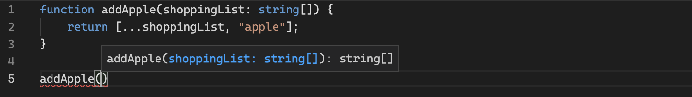

# Introduction

<div class="img-single-small">
  
</div>

JavaScript is not a [statically typed][statically-typed-url] language, it is [dynamically typed][dynamically-typed-url], meaning the types of variables (and other constructs in the language) are not checked until the time of code execution, i.e. after the code has been written and is running in the browser or Node.js environment. Variables in statically typed languages like C#, Java and Go, however, have their types checked before the code is executed, typically during a compilation step.

JavaScript, being a dynamically typed language, suffers from only getting type errors late in the development cycle when compared to statically typed languages. This leads to mistakes in the code, often simple ones, that could otherwise have been prevented by a quicker feedback loop on how types are being used.

TypeScript helps bridge this gap in JavaScript, bringing type safety to a language which was created over [25 years ago][javascript-info-url]. JavaScript has since [matured][javascript-maturity-url] and become [one of the most popular programming languages][javascript-popularity-url] in recent years for all kinds of application development, so the introduction of type safety was a welcome adaptation to the language for many developers.

# TypeScript

Due to the lack of static typing, writing JavaScript can sometimes feel like guesswork, especially to those less experienced with the language, or when you're working with third-party libraries. Only when you run your code do you realise you got some syntax wrong.

When using TypeScript, you feel more confident that what you have written will work as you expect; you spend less time checking how something should be called and more time solving the problem at hand.

## The TypeScript Compiler

<div class="img-single-medium">
  
</div>

JavaScript engines, like Google's [V8][google-v8-url] which is used in Chrome and Node.js, cannot execute TypeScript code; it must first be compiled, or more accurately transpiled, into JavaScript code.

The [TypeScript compiler][typescript-compiler-npm-url] is responsible for converting TypeScript code to its equivalent JavaScript code which can then be executed. This compilation process does a few things, most notably:

-   Removing all of the type information you worked so hard on adding and maintaining during development. Remember, TypeScript is purely a development tool to help us write better JavaScript, and has no direct impact on the code when it's being executed.
-   Downlevelling (often referred to as transpiling) the JavaScript code to a desired ECMAScript version through the [target][typescript-target-config-url] config option. Downlevelling is the process of altering the JavaScript code to ensure that it can safely run in your target environments.

The TypeScript compiler can easily fit into a Webpack workflow using the [ts-loader][ts-loader-url], and even comes pre-installed and configured when using libraries like [Create React App][create-react-app-typescript-url] and [Vue CLI][vue-cli-typescript-url].

### What About Babel?

<div class="img-single-medium">
  
</div>

The TypeScript compiler and [Babel][babeljs-url] are very similar tools, and often you can choose one or the other - they are both capable of TypeScript to JavaScript compilation and JavaScript downlevelling.

**However, there is a key difference** - Babel cannot type check TypeScript code, it can only convert it to its JavaScript equivalent; you would still need to use the TypeScript compiler to verify your usage of types.

Unless you're developing an application which requires the use of Babel, I'd recommend just using the TypeScript compiler.

## Is TypeScript its Own Language?

This is quite a common misunderstanding for those new to TypeScript, and can be one of a few factors which deters developers from picking up TypeScript - the expectation that they will need to invest many more hours learning a new language, with new syntax to get familiar with and with its own quirks to understand.

Yes - TypeScript is its own programming language, but that's quite a misleading statement. TypeScript is developed and maintained by Microsoft and is [described as][typescript-url] "a strict syntactical superset of JavaScript" which "adds optional static typing to the language".

So really it can be thought of more as an adaptation of the JavaScript language, with some nice optional extras - most notably type safety. If you know JavaScript you can very quickly start writing TypeScript code, and TypeScript code will look very familiar to you - functions look largely the same and you'll still use things like `let` and `const` to declare variables.

"a strict syntactical superset of JavaScript" means that strictly all JavaScript code is valid TypeScript code. This is important as it means TypeScript can be adopted incrementally, and a project can have a mixture of both JS and TS files at any one time; you can use as much or as little as you want from TypeScript.

## A Simple Example

Below is a trivial example of JavaScript and its TypeScript equivalent, with an obvious flaw meaning it will always fail at runtime. Here, we try to add a new item to an array parameter using the [spread operator][spread-operator-url]. Further examples in this post will cover some more realistic and less obvious type errors which TypeScript can help us with.

```
function addApple(shoppingList) {
    return [...shoppingList, "apple"];
}

addApple(1);
```

If you were to execute the JavaScript code above, you would be met with a `TypeError`, because we've tried to call the spread operator on the number 1, rather than something which is an iterable (specifically an array in this case). There is no**\*** early feedback telling us that we're misusing the `addApple` function until we actually use it, and then it falls over with the error below:

<div class="image-thin-border-container">
  
</div>
<p class="img-attribute">We only find out that there is a TypeError when the function is executed.</p>

Below is the TypeScript equivalent. Note the only difference is the use of `: string[]` to specify what type we expect `shoppingList` to be.

```
function addApple(shoppingList: string[]) {
    return [...shoppingList, "apple"];
}

addApple(1);
```

The above example fails when running through the TypeScript compiler, and even gives us the error in the IDE right as the code is being written. Intellisense is also available to inform us how to use the function.

<div class="image-thin-border-container">
  
</div>
<p class="img-attribute">We get an early warning in the IDE that the function is not being used correctly.</p>

<div class="image-thin-border-container">
  
</div>
<p class="img-attribute">We get intellisense for the function to inform us how it should be called.</p>

**\*** There is an exception to this when using some IDEs like VSCode which is discussed in a later section.

# TypeScript Fundamentals

## Duck Typing

-   Structural type system (aka duck typing https://www.typescriptlang.org/docs/handbook/typescript-in-5-minutes.html#structural-type-system) only requires a subset of an object's fields to match. There is no difference between how classes and objects conform to shapes
-   nominal type system (https://www.typescriptlang.org/play#example/nominal-typing)

## Module Imports

## Type Guards

## Type Definition Files

## Encapsulation

Readonly<T> and ReadonlyArray<T>, private readonly, const assertion

## Generics

## Interfaces and Types

## OOP

-   implementing interfaces, inheritance, static methods.

## Working with Third-Party Libraries

-   Really helpful when types are supported
-   Type Definition files
-   @types libs

## Type Inference

## Union and Intersection Types

## None Types

any, unknown, never and void types (https://www.typescriptlang.org/docs/handbook/typescript-in-5-minutes.html) To get an error when TypeScript produces an any, use "noImplicitAny": true, or "strict": true in tsconfig.json.

## typeof, instance of

## Namespaces

# My Key Takeaways / Fave Parts

-   Explicit returns
-   Using interfaces and types

[statically-typed-url]: https://en.wikipedia.org/wiki/Type_system#Static_type_checking
[dynamically-typed-url]: https://en.wikipedia.org/wiki/Type_system#Dynamic_type_checking_and_runtime_type_information
[javascript-popularity-url]: https://pypl.github.io/PYPL.html
[javascript-maturity-url]: https://en.wikipedia.org/wiki/JavaScript#Reaching_maturity
[typescript-url]: https://en.wikipedia.org/wiki/TypeScript
[typescript-target-config-url]: https://www.typescriptlang.org/tsconfig#target
[typescript-compiler-npm-url]: https://www.typescriptlang.org/download
[babeljs-url]: https://babeljs.io
[spread-operator-url]: https://developer.mozilla.org/en-US/docs/Web/JavaScript/Reference/Operators/Spread_syntax
[javascript-info-url]: https://en.wikipedia.org/wiki/JavaScript
[create-react-app-typescript-url]: https://create-react-app.dev/docs/adding-typescript/#installation
[vue-cli-typescript-url]: https://v3.vuejs.org/guide/typescript-support.html#project-creation
[google-v8-url]: https://v8.dev/
[ts-loader-url]: https://github.com/TypeStrong/ts-loader
