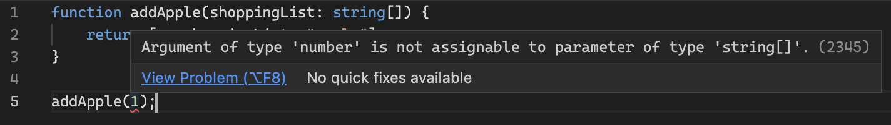

# Introduction

<div class="img-single-small">
  
</div>

I have been using TypeScript every day now for a while for both front and back-end development, and in doing so, I've learnt a lot about the language and the benefits of using it over JavaScript. This post aims to introduce the TypeScript language, look at some common misconceptions, and showcase what benefits can be found from using it.

A future post will take a deeper dive into the language and focus on some of the more advanced topics.

# The Type System

<div class="img-single-small">
  
</div>

## Static Typing in TypeScript

JavaScript is not a [statically typed][statically-typed-url] language, it is [dynamically typed][dynamically-typed-url], meaning the types of variables (and other constructs in the language) are based on their assigned values and are not checked until the time of code execution, i.e. after the code has been written and is running in the browser or Node.js environment. Variables in statically typed languages like C#, Java and Go, however, have their types checked before the code is executed, typically during a compilation step.

JavaScript, being a dynamically typed language, suffers from only getting type errors late in the development cycle when compared to statically typed languages. This leads to mistakes in the code, often simple ones, that could otherwise have been prevented by a quicker feedback loop on how types are being used.

TypeScript helps bridge this gap in JavaScript, bringing type safety to a language which was created over [25 years ago][javascript-info-url]. JavaScript has since [matured][javascript-maturity-url] and become [one of the most popular programming languages][javascript-popularity-url] for all kinds of application development, so the introduction of type safety was a welcome adaptation to the language for many developers.

Due to the lack of static typing, writing JavaScript can sometimes feel like guesswork, especially to those less experienced with the language, or when you're working with third-party libraries. Only when you run your code do you realise you got some syntax wrong.

When using TypeScript, you feel more confident that what you have written will work as you expect; you spend less time checking how something should be called and more time solving the problem at hand.

## Structural Typing in TypeScript

JavaScript is also a duck typed language meaning no type checks are performed prior to the code running, and when it runs, it will try execute whatever it can on the objects supplied, regardless of their type or structure. TypeScript uses structural typing, meaning it determines types based on their structure - what properties and functions an object has, and these type checks happen at compile time, not runtime.

More on these typing systems below.

<div class="img-single-small">
  
</div>

### Duck Typing

A duck typed language is one which performs no type checks at compile time, only at runtime when code is being executed. And those runtime type checks only check the shape of an object - if you're trying to access a property or call a function on an object, and it's there, then it will work just fine, regardless of how that object was created or what else exists on it. Dynamically typed languages use duck typing.

[Duck typing][duck-typing-wikipedia-url] gets its name from the duck test - "If it walks like a duck and it quacks like a duck, then it must be a duck".

By this definition, JavaScript is a duck typed language, which can easily be demonstrated with the example below:

```
const house = {
    lock: () => console.log("Front door locked!"),
    openGarageDoor: () => console.log("Garage door opened!"),
};

const car = {
    lock: () => console.log("Driver door locked!"),
    start: () => console.log("Car started!"),
};

const lockHouse = (house) => house.lock();

lockHouse(house);   // "Front door locked!"
lockHouse(car);     // "Driver door locked!"
```

This example runs just fine, logging out the locked messages for `house` and `car`. The `lockHouse` function doesn't care what object is passed to it, nor what else exists on it, as long as that object has a `lock` function it can call. For this example, the `car` object matches the behaviour and structure expected by the `lockHouse` function, so as far as it's concerned - a car is a house &#129300;&hellip;

However, although this code works, **it is fragile** and is susceptible to runtime errors. If the implementation of `lockHouse` were to change and now call `house.openGarageDoor()` instead, then it would result in a runtime type error when `lockHouse` is called with `car`. Structural typing solves this problem for us.

<div class="img-single-small">
  
</div>

### Structural Typing

Structural typing, as used in TypeScript, builds on top of duck typing by validating how types are used at compile time. It uses the same principle as duck typing, whereby type compatibility is determined based on shape (the properties and functions available), but it aims to further validate that there's enough structural overlap between the type being used and what's expected. If there's enough overlap, then the types are deemed compatible and TypeScript will be happy, but if there isn't, TypeScript will tell us to prevent type errors.

To demonstrate this, see the example below.

```
// Declare a Car type with wheel and door count properties as numbers
// and a lock function which has no return value.
type Car = {
    wheelCount: number;
    doorCount: number;
    lock: () => void;
}

// Declare a House type with a door count property as a number
// and a lock function which has no return value.
type House = {
    doorCount: number;
    lock: () => void;
}

// Create an object of each type.
const car: Car = {
    wheelCount: 4,
    doorCount: 5,
    lock: () => console.log('Car locked!')
}

const house: House = {
    doorCount: 3,
    lock: () => console.log("House locked!")
}

// Create a locking function for each type.
const lockHouse = (house: House) => house.lock();
const lockCar = (car: Car) => car.lock();

// Attempt to pass both objects to the `lockHouse` function. All OK.
lockHouse(house);
lockHouse(car);

// Attempt to pass both objects to the `lockVehicle` function. We get a Type Error.
lockCar(car);
lockCar(house); // Type error
```

In this example, two types are being declared - `Car` and `House`, and an object is created for each of these types. As you can see, there is some structural overlap between these two types - they both have a `doorCount` property and a `lock` function. However, there is an additional property on a Car - `wheelCount` - which is causing the type error.

There is sufficient overlap between `Car` and `House` such that `lockHouse` can accept the `Car` type, but `lockCar` cannot accept the `House` type because it is missing the `wheelCount` property. In other words, `Car` can be seen as a subtype of `House`, meaning wherever a house is expected, we can also pass a car, but the same cannot be said the other way around.

Looking at the type error produced by TypeScript in more detail, it's telling us exactly this: `TypeError - Argument of type 'House' is not assignable to parameter of type 'Car'. Property 'wheelCount' is missing in type 'House' but required in type 'Car'.`

### Nominal Typing (Name-based)

Just to round off on the type systems, it's worth covering nominal typing.

Most traditional statically typed languages like C# and Java are nominally typed, meaning the identity of the type itself is important, not just whether types share the same properties and behaviour.

In C# for example, if you have two interfaces which are identical in their structure, they still cannot be used interchangeably, because they fundamentally identify as different types through their name. Back to the `Car` and `House` example - they are named differently and so are not equivalent in nominal type systems.

# The TypeScript Compiler

<div class="img-single-medium">
  
</div>

JavaScript engines, like Google's [V8][google-v8-url] which is used in Chrome and Node.js, cannot execute TypeScript code; it must first be compiled, or more accurately transpiled, into JavaScript code.

The [TypeScript compiler][typescript-compiler-npm-url] is responsible for converting TypeScript code to its equivalent JavaScript code which can then be executed. This compilation process does a few things, most notably:

-   Removing all of the type information you worked so hard on adding and maintaining during development. TypeScript is purely a development tool to help us write better JavaScript, and has no direct impact on the code when it's being executed.
-   Downlevelling (often referred to as transpiling) the TypeScript code to a desired ECMAScript version through the [target][typescript-target-config-url] config option. Downlevelling is the process of altering the TypeScript code to ensure that the resulting JavaScript can safely run in your target environments, typically browsers.

The TypeScript compiler can easily fit into a Webpack workflow using the [ts-loader][ts-loader-url], and even comes pre-installed and configured when using libraries like [Create React App][create-react-app-typescript-url] and [Vue CLI][vue-cli-typescript-url].

## What About Babel?

<div class="img-single-medium">
  
</div>

The TypeScript compiler and [Babel][babeljs-url] are very similar tools, and often you can choose one or the other - they are both capable of TypeScript compilation and downlevelling.

**However, there is a key difference** - Babel cannot type check TypeScript code, it can only convert it to its JavaScript equivalent; you would still need to use the standalone TypeScript compiler to verify correct usage of types in your code.

Unless you're developing an application which requires the use of Babel, I'd recommend just using the TypeScript compiler.

# A Simple Example

Below is a trivial example of a JavaScript code snippet and its TypeScript equivalent, with an obvious flaw meaning it will always fail at runtime. Here, we try to add a new item to an array parameter using the [spread operator][spread-operator-url].

```
function addApple(shoppingList) {
    return [...shoppingList, "apple"];
}

addApple(1);
```

If you were to execute the JavaScript code above, you would be met with a type error, because we've tried to call the spread operator on the number one, rather than something which is an iterable (specifically an array in this case). There is no**\*** early feedback telling us that we're misusing the `addApple` function until we actually use it, and then it falls over with the error below:

<div class="image-thin-border-container">
  
</div>
<p class="img-attribute">We only find out that there is a type error when the function is executed.</p>

Below is the TypeScript equivalent. Note the only difference is the use of `: string[]` to specify what type we expect `shoppingList` to be.

```
function addApple(shoppingList: string[]) {
    return [...shoppingList, "apple"];
}

addApple(1);
```

The above example fails when running through the TypeScript compiler, and even gives us the error in the IDE right as the code is being written. Intellisense is also available to inform us how to use the function.

<div class="image-thin-border-container">
  
</div>
<p class="img-attribute">We get an early warning in the IDE that the function is not being used correctly.</p>

<div class="image-thin-border-container">
  
</div>
<p class="img-attribute">We get intellisense for the function to inform us how it should be called.</p>

**\*** There is an exception to this when using some IDEs like VSCode which will be discussed in a future post.

# Is TypeScript its Own Language?

This is quite a common misunderstanding for those new to TypeScript, and can be one of a few factors which deters developers from picking up TypeScript - the expectation that they will need to invest more hours into learning a new language, with new syntax to get familiar with and with its own quirks to understand.

Yes - TypeScript is its own programming language, but that's quite a misleading statement. TypeScript is developed and maintained by Microsoft and is [described as][typescript-url] "a strict syntactical superset of JavaScript" which "adds optional static typing to the language".

So really it can be thought of more as an adaptation of the JavaScript language, with some nice optional extras - most notably type safety. If you know JavaScript you can very quickly start writing TypeScript code, and TypeScript code will look very familiar to you - for example, functions look largely the same and you'll still use things like `let` and `const` to declare variables.

"a strict syntactical superset of JavaScript" means that strictly all JavaScript code is valid TypeScript code. This is important as it means TypeScript can be adopted incrementally, and a project can have a mixture of both JS and TS files at any one time; you can use as much or as little as you want from TypeScript. This helps reduce the barrier to entry for getting started and means an application migration to TypeScript needn't happen in one big release.

# Getting Started with TypeScript

This has only been a light introduction to TypeScript, with lots more to be covered in detail in my next blog post, so keep an eye out for that <span role="img" aria-label="Eyes emoji">&#128064;</span>

In the meantime, I recommend the following resources:

-   The [TypeScript Handbook][typescript-handbook-url] is an excellent guide to TypeScript which covers all of the key concepts with examples and clear explanations.
-   The [TypeScript Playground][typescript-playground-url] is an online editor which is pre-configured with TypeScript so you can start coding right away. It has a VSCode-like feel with syntax highlighting, logging output and the ability to see the resulting JavaScript code after compilation.
-   [TSDX][tsdx-github-url] is a brilliant library for quickly getting a TypeScript library off the ground. Applications created using TSDX not only have TypeScript configured out of the box, but also prettier and ESLint, and [Jest][jest-url] unit tests ready to run.

[statically-typed-url]: https://en.wikipedia.org/wiki/Type_system#Static_type_checking
[dynamically-typed-url]: https://en.wikipedia.org/wiki/Type_system#Dynamic_type_checking_and_runtime_type_information
[javascript-popularity-url]: https://pypl.github.io/PYPL.html
[javascript-maturity-url]: https://en.wikipedia.org/wiki/JavaScript#Reaching_maturity
[typescript-url]: https://en.wikipedia.org/wiki/TypeScript
[typescript-target-config-url]: https://www.typescriptlang.org/tsconfig#target
[typescript-compiler-npm-url]: https://www.typescriptlang.org/download
[babeljs-url]: https://babeljs.io
[spread-operator-url]: https://developer.mozilla.org/en-US/docs/Web/JavaScript/Reference/Operators/Spread_syntax
[javascript-info-url]: https://en.wikipedia.org/wiki/JavaScript
[create-react-app-typescript-url]: https://create-react-app.dev/docs/adding-typescript/#installation
[vue-cli-typescript-url]: https://v3.vuejs.org/guide/typescript-support.html#project-creation
[google-v8-url]: https://v8.dev/
[ts-loader-url]: https://github.com/TypeStrong/ts-loader
[duck-typing-wikipedia-url]: https://en.wikipedia.org/wiki/Duck_typing
[typescript-handbook-url]: https://www.typescriptlang.org/docs/handbook/intro.html
[typescript-playground-url]: https://www.typescriptlang.org/play
[tsdx-github-url]: https://github.com/jaredpalmer/tsdx
[jest-url]: https://jestjs.io/
