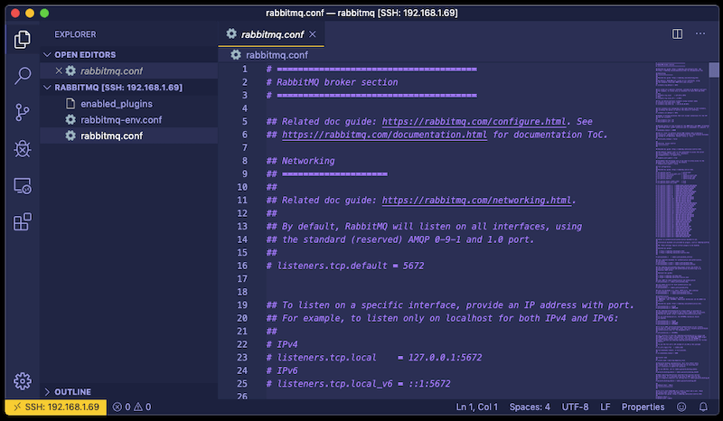
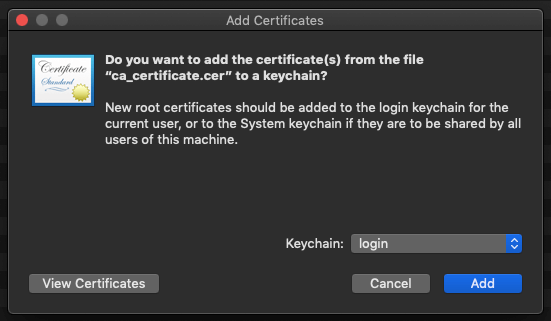

# Introduction

The RabbitMQ broker can be configured to use SSL for secure traffic encryption, and as a secure alternative to Basic username/password for client authentication, however it can be difficult to get set up. This post aims to explain the process in a clearer more concise way compared to the documentation.

I will be explaining how I installed RabbitMQ on a Raspberry Pi running Raspbian, and set up SSL and client Certificate Authentication with a .NET Core 3.0 Console Application and a .NET Standard 2.1 library. Some working knowledge of RabbitMQ is assumed; if you are unfamiliar with RabbitMQ, I recommend running through some tutorials on the [official website][rabbitmq-url] first.

## Client Authentication in RabbitMQ

There are two authentication mechanism options available in RabbitMQ &mdash; Basic username/password and Certificate Authentication. Basic Authentication is the default, but is not the most secure of the two available options. In my opinion, Certificate Authentication is recommended for a few reasons:

-   It separates out the responsibility of authentication from the client connection code, meaning clients can be updated to use new authentication credentials transparently, without any need for a re-deploy of the application.
-   For enhanced security, and similar to how a policy can be set which requires a user's password to be changed regularly, certificates can be set with short expiry dates and regularly regenerated and reissued. This helps ensure that only clients who should be able to, can connect to the RabbitMQ server. This again is a transparent process, assuming the certificates are stored in the same location on the client's machine, are generated using the same trusted Certificate Authority (CA) and the private key password is unchanged.
-   Many organisations already have their own internal CA, so being able to generate and manage certificates should not be a big undertaking. It also allows for these certificates to be centrally controlled by a dedicated Systems Administration team.

## SSL/TLS vs Peer Verification vs Client Certificate Authentication

Getting RabbitMQ to work over SSL can be tricky, and it is not helped by a confusion of terminology. SSL, Peer Verification and Certificate Authentication are very similar, but play a different role in the configuration of SSL in RabbitMQ.

### SSL/TLS

SSL and TLS are both cryptographic protocols used to secure data transmitted between a client and server, with TLS being the newer protocol which superseded SSL a while ago. The RabbitMQ documentation and .NET client make reference to SSL, but more in the generic sense of a secure connection protocol, rather than the actual outdated implementation. For consistency, I have used the same approach in this blog post. But for all intents and purposes, SSL actually means TLS in this context.

Enabling SSL is allowing RabbitMQ to accept connections on a secure port, ensuring traffic to and from the server is encrypted. Just like HTTPS, the server presents its certificate containing the public key during the TLS handshake. I won't be going into any further detail about SSL in this post, but there are plenty of resources online to help, including this [YouTube][ssl-youtube-video-url] video.

The exact server configuration required will be described later, but in short, SSL is enabled on RabbitMQ by setting the desired port and pointing it to a pair of public and private key files, and a CA file which signed the certificate/key pair. For a trusted connection to be established, the client applications will need to trust the same CA.

### Peer Verification

Peer Verification builds on top of SSL, and is a way for RabbitMQ to verify that the clients which are attempting to connect can be trusted, that is &mdash; they present a certificate which is signed by a CA which the server also trusts. This helps ensure that only trusted clients can connect to the broker and helps prevent against Man-in-the-Middle attacks.

If the client is not able to supply a trusted certificate, then the server will reject the connection. The exception to this is if the `fail_if_no_peer_cert` configuration option is set to `verify_none`, in which case, the server will allow the connection.

Peer Verification is not required in order to use SSL, but it is highly recommended, at least in production environments.

### Client Certificate Authentication

SSL can also be used as a mechanism for clients to authenticate with the broker instead of the default username and password mechanism. In order for clients to authenticate with SSL, they must present a certificate to the server which is signed by a trusted CA, and which contains the login username as the Common Name (CN) or Subject Alternative Name (SAN). More details on how to configure this later.

# Technical Implementation

I installed RabbitMQ Server on Raspbian &mdash; a Linux distro for the Raspberry Pi &mdash; but the process shouldn't be too dissimilar for other distros or even for Windows.

## RabbitMQ Server Installation

As previously mentioned, I installed RabbitMQ Server on a Raspberry Pi 2 running a new installation of Raspbian (kernel version 4.19).

I ran the following commands to install RabbitMQ, enable the Management UI plugin and start the service:

```
> apt-get install rabbitmq-server
> rabbitmq-plugins enable rabbitmq_management
> service rabbitmq-server start
```

## Enabling SSL

### Creating the Certificates

The first step to enabling SSL is to create the required certificate files that will be used on both the server and client machines. I followed the [RabbitMQ documentation][rabbitmq-generating-certs] on how to generate the required certificates using OpenSSH. I will not replicate the steps here as it is clearly described in the documentation, but I will highlight a few things which didn't seem obvious to me:

-   The step to generate a client certificate is only required if you want to use Peer Verification. It is also required if you plan on using certificates for client authentication.
-   The CA file, which is used to self-sign the certificates, needs to be in the `.pem` format for RabbitMQ.
-   The CN or SAN of the server certificate must be set to the name of the host machine on which the broker will be running. The documentation states to use `$(hostname)`, but this should only be used if the machine you are generating the certificate is the same machine on which the broker will be running on.
-   The CN of the client certificate can be set to any arbitrary value, unless you are using the certificate for client authentication (explained later).
-   The passwords used to protect the server and client private keys can, and should, be different.
-   Although it is common to do it this way, the server and client certificates do not have to be signed by the same CA. They can be different, as long as they are both trusted by the server and the client.

At this point, you should have the following files available:

-   A CA file in the `.pem` format.
-   A certificate/key pair for the server in the `.pem` format, signed by the CA, whose CN or SAN value is set to the hostname of the machine RabbitMQ will be running on.
-   A certificate/key pair for each client, signed by the CA. The format depends on the client-specific implementation.

Bear in mind, some of the most common SSL connection issues come about due to errors in the certificates, so it's worth taking care in this area to minimise any troubleshooting you may have to do.

### Enabling SSL in RabbitMQ

SSL is enabled in the RabbitMQ configuration file, typically located in the `/etc/rabbitmq` directory on Linux. The `rabbitmq.conf` did not exist after my installation, so I created it, and added the following lines to enable SSL:

```
listeners.ssl.default               = 5671
ssl_options.cacertfile              = /etc/rabbitmq/ssl/ca_certificate.pem
ssl_options.certfile                = /etc/rabbitmq/ssl/server_certificate.pem
ssl_options.keyfile                 = /etc/rabbitmq/ssl/private_key.pem
ssl_options.password                = SuperSecretPassword123
```

The above config sets the SSL port (5671 is the default), and tells the broker where to find the cert files. Obviously this assumes that the cert files from the previous step have been transferred to the server. I chose to place my cert files in a new `ssl` directory.

If you also want to enable Peer Verification, add the following lines too:

```
ssl_options.verify                  = verify_peer
ssl_options.fail_if_no_peer_cert    = true
```

You'll want to restart the broker service at this point, and after any change to the config file. Now, RabbitMQ is set up to accept secure connections and transmit data in encrypted form to any clients which connect via this SSL port. If you want to disable non-SSL connections, this can be done with the following entry:

```
listeners.tcp = none
```

As an aside &mdash; I chose this as an opportunity to give [Remote Development using SSH in VS Code][remote-development-using-ssh-in-vs-code] a try, and overall it worked pretty well. I had some issues with connecting at times, but it was great to be able to edit files on a remote server using a familiar development environment (if you're a hardcore vim user, it might not be right for you!). I used [this guide][raspberry-pi-ssh-guide] to assist with enabling SSH on my Raspberry Pi.



### Client Connections via SSL

Now that SSL is setup on the broker, we need to create a client which will connect via SSL so it can securely produce and consume from the message queues.

I chose to create a .NET client application &mdash; a .NET Core 3.0 Console Application along with a supporting .NET Standard 2.1 class library. The full client code along with unit tests is available in a [repository][rabbitmq-demo-repo-url] on my GitHub account. I hope it serves as a good example of how to work with the RabbitMQ NuGet package to create a well-structured, testable and maintainable codebase that can be applied all the way up to large-scale Enterprise applications. I plan on using this code as a basis for a future blog post on writing good object oriented code following design principles like DRY and SOLID.

After installing the RabbitMQ NuGet package, I configured SSL in the `ConnectionFactory` with the following:

```
Ssl.Enabled = true;
Ssl.ServerName = settings.ServerName;
Ssl.CertPath = settings.CertPath;
Ssl.CertPassphrase = settings.CertPassphrase;
Ssl.Version = settings.Protocol;
Port = settings.Port;
```

A few points to note with the above configuration:

-   At least when using the .NET client, Server Name here _must_ match the CN or SAN which is set on the server certificate.
-   `CertPath` and `CertPassphrase` are for the client certificate and password (if set), and are only required if Peer Verification is enabled.
-   `Version` is optional, and will be set by default to TLS v1.2.

Because we have enabled Peer Verification, we need to ensure the necessary certificates are installed and available on the client machine.

One of the outputs when using OpenSSH to generate the client certificates is a `.p12` file, which is the format expected by the .NET client. The path to this file must be set in `Ssl.CertPath`.

The CA bundle must be installed on the client machine as a trusted authority. I did this on my Mac by double clicking on the file and adding it to the Keychain of the my user. This CA is now trusted on the client machine, which means both the server and client certificates are inherently trusted too.



### Testing SSL Connections

At this point, you should be ready to test your SSL connection to the broker. One of the most common errors you can get on the client at this point is "Unhandled exception. RabbitMQ.Client.Exceptions.BrokerUnreachableException: None of the specified endpoints were reachable".

This is a frustrating error to receive as the exception message does not always give a clear indication of what has gone wrong, but for me has always come down to one of the following reasons:

-   The broker is not reachable from the client. Try `ping` the host from the client machine to see if it is reachable.
-   SSL is not enabled on the server. Restart the RabbitMQ service and then look in the log file (typically `/var/log/rabbitmq/rabbit@raspberrypi.log`). You should see the following entry, indicating that SSL has been enabled:

```
[info] <0.397.0> started SSL Listener on [::]:5671
```

-   `Ssl.ServerName` does not match the hostname of the server on which the broker is running.
-   `Port` does not match the port number set in the RabbitMQ config.
-   The broker does not have permission to read the certificate files. Check the file ownership and permissions.

## Using SSL for Client Authentication

Setting up Client Certificate Authentication is straight forward once SSL has been configured. It works on the principle of having password-less user logins, and clients authenticating with the broker by providing the username as the CN or SAN on the certificate they supply. Passwords are not required, as clients who posses a trusted certificate are implicitly authenticated.

### Server Side Changes

Firstly, the broker needs to be updated to allow authentication using certificates. RabbitMQ comes by default with a plugin for handling SSL as an authentication mechanism. Enable this plugin with the following command:

```
> rabbitmq-plugins enable rabbitmq_auth_mechanism_ssl
```

And now make the following additions to the `rabbitmq.conf` file:

```
auth_backends.1   = rabbit_auth_backend_internal
auth_mechanisms.1 = PLAIN
auth_mechanisms.2 = EXTERNAL
```

Authentication Backends configure where the user logins are stored. By default, this is set to `rabbit_auth_backend_internal`, but there other options available, like LDAP for example (if you want to make use of an existing user store in Active Directory). I added this line explicitly just for completeness.

Authentication Mechanisms configure how user/client authentication should be performed. By default, this is set to `PLAIN` which is Basic username/password authentication. We need to also add `EXTERNAL` as an additional mechanism to support SSL authentication. `PLAIN` must remain as a mechanism if you wish to still have access via the Management UI.

As previously mentioned, the CN or SAN values are used to obtain the username for the client connection. By default, SAN is used, which is equivalent to the `subj` parameter passed to OpenSSL when generating the client certificate. To use the CN value instead, add the following to the broker config:

```
ssl_cert_login_from: common_name
```

Now restart the RabbitMQ service for the changes to take effect:

```
> service rabbitmq-server restart
```

Finally, add a password-less user through the Management UI which will be used for the client authenticating with the broker. Keep note of the username you choose here for the next section.

#### Client Side Changes

In order to be able to authenticate with the broker using SSL, the certificate which the client presents on connection must have the CN or SAN set to the username of the password-less user created previously. Regenerate and replace the client certificate files if necessary. And finally, the `ConnectionFactory` must be changed to use the `EXTERNAL` authentication mechanism.

```
AuthMechanisms = externalMechanismFactory == null
    ? throw new ArgumentNullException(nameof(externalMechanismFactory))
    : new List<AuthMechanismFactory> { externalMechanismFactory };
```

At this point, you should have a working solution for authenticating with RabbitMQ using certificates. Check out the full code example on [GitHub][rabbitmq-demo-repo-url] if you are having issues, or if you are interested in seeing the complete .NET example code.

[rabbitmq-url]: https://www.rabbitmq.com/getstarted.html
[ssl-youtube-video-url]: https://youtu.be/T4Df5_cojAs
[rabbitmq-generating-certs]: https://www.rabbitmq.com/ssl.html#manual-certificate-generation
[remote-development-using-ssh-in-vs-code]: https://code.visualstudio.com/docs/remote/ssh
[raspberry-pi-ssh-guide]: https://www.raspberrypi.org/documentation/remote-access/ssh/
[rabbitmq-demo-repo-url]: https://github.com/cjshelton/RabbitMQDemo
